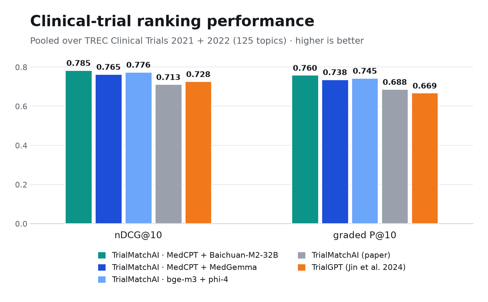
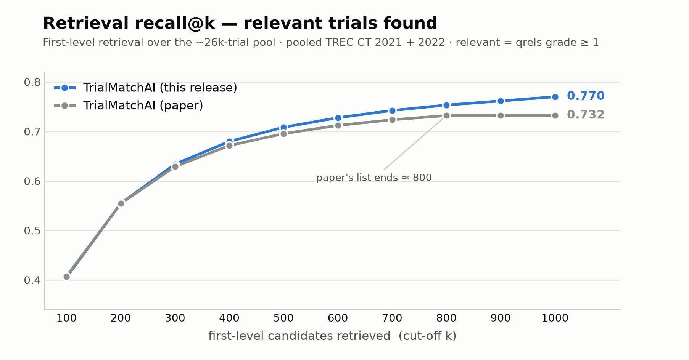

<div align="center">


<p><b>TrialMatchAI matches patients to the clinical trials they're eligible for.</b> Give it a patient as clinical notes, FHIR, a Phenopacket, or OMOP data, and it returns a ranked shortlist of trials, each one explained criterion by criterion so you can see why the patient does or doesn't qualify. Everything runs on your own infrastructure on a single GPU server, so patient data never leaves your environment.</p>

<p>
  <a href="#installation">Install</a> ·
  <a href="#quickstart">Quickstart</a> ·
  <a href="#how-it-works">How it works</a> ·
  <a href="#configuration">Configuration</a> ·
  <a href="#cli-reference">CLI</a>
</p>

</div>

> **⚕️ For research and informational use only.** TrialMatchAI is not medical
> advice, not a medical device, and must not replace review by qualified
> healthcare professionals.

## Overview

TrialMatchAI works in two halves. You build the matching system once, then you
match patients against it as often as you like. Both halves only do work that
isn't already done, and both resume cleanly after an interruption.

- **Build** is the heavy one-time setup, and it needs a GPU. It prepares a
  searchable corpus of clinical trials (embeddings, biomedical entity
  annotations, and parsed eligibility constraints) and builds a local search
  index.
- **Match** ingests a patient, retrieves candidate trials, and reasons over each
  trial's eligibility criteria to produce a ranked, explained shortlist. It writes
  that out as a self-contained HTML report you can open in any browser.

Trials, models, indexes, and results all live on your own machine.

## Performance

This release ships two TrialMatchAI configurations: a clinical one that pairs the
MedCPT retriever with MedGemma, and a general one that pairs bge-m3 with phi-4. On
the official **TREC Clinical Trials** benchmark (2021 and 2022, 125 topics
pooled), both of them rank eligible trials more accurately than the published
TrialMatchAI system (the “paper” bars) and than **TrialGPT** (Jin et al., *Nature
Communications* 2024):

<picture>
  <source media="(prefers-color-scheme: dark)" srcset="docs/assets/performance_dark.png">
  
</picture>

<sub>nDCG@10 and graded P@10 pooled over TREC Clinical Trials 2021 and 2022 (125
topics), computed on judged trials. The two TrialMatchAI configurations and the
paper use the identical ranking metric on the same topics, so those comparisons
are exact. TrialGPT shows the value reported in Jin et al. (2024); their
evaluation also includes the SIGIR 2016 cohort, so treat it as an indicative
reference rather than a matched run. Reproduce ours with `trialmatchai trec
--tracks "21 22"`.</sub>

**Reasoning model, side by side.** The eligibility-reasoning model is a config
swap, so trying a different one is easy. Holding MedCPT retrieval fixed, we ran a
larger thinking model, Baichuan-M2-32B, against the two default reasoners across
all 125 TREC topics:

| Configuration | nDCG@10 | graded P@10 | P@10 (eligible) |
| --- | --- | --- | --- |
| MedCPT + Baichuan-M2-32B | **0.785** | **0.760** | **0.699** |
| bge-m3 + phi-4 | 0.776 | 0.745 | 0.690 |
| MedCPT + MedGemma-27B | 0.765 | 0.738 | 0.690 |

<sub>Pooled over TREC Clinical Trials 2021 and 2022 (125 topics), condensed to
judged trials, same metric as the figure above. Baichuan-M2-32B ranks eligible
trials best on every metric, but the margin is small (about 0.01 to 0.02) and comes
almost entirely from the 2021 track; on 2022 the bge-m3 + phi-4 config is slightly
ahead. One caveat for a fair read: Baichuan ran with grammar-constrained JSON
output, so nearly all of its verdicts parsed, while MedGemma and phi-4 had roughly
8% parse failures that can drop otherwise-eligible trials. The edge is real but
modest, and partly a formatting effect.</sub>

**Retrieval recall by embedder.** This is the share of eligible trials (qrels
grade 2) that the first-level search surfaces among its top *k* candidates, across
four embedders: two general-purpose ones (bge-m3, Qwen3-Embedding) and two
clinical ones (MedCPT, PubMedBERT). The clinical embedders lead on both tracks:

<picture>
  <source media="(prefers-color-scheme: dark)" srcset="docs/assets/recall_dark.png">
  
</picture>

<sub>TREC-standard recall@k over eligible trials (qrels grade 2), first-level
retrieval only, per track (TREC CT 2021 and 2022; a candidate pool of roughly 26k
trials) with hybrid retrieval at vector weight 0.6. Each embedder indexes the same
corpus with concept linking held fixed, so the retrieval embedder is the only
thing that changes. The two clinical embedders, MedCPT (native dot product) and
PubMedBERT, lead the two general ones (bge-m3 and the strong general-purpose
Qwen3-Embedding) at every depth. Domain specialization beats a larger general
model here. Reproduce with `scripts/benchmark_embedder.py`.</sub>

## Requirements

- Python 3.11 (`pyproject.toml` requires `>=3.11,<3.12`)
- `pip` or `uv`, to install from PyPI or from a source checkout for development
- An NVIDIA GPU for the model-based matching and fine-tuning
- Around 100 GB of disk for datasets, model artifacts, search indexes, manifests,
  and run outputs
- OMOP vocabulary files, only if you want to build the concept-linking table
  yourself

## Installation

### From PyPI (recommended)

```bash
pip install trialmatchai          # or: uv pip install trialmatchai
trialmatchai --help
```

That installs the package and the `trialmatchai` CLI with its base dependencies.
For matching with the models, add the runtime extras:

```bash
pip install "trialmatchai[llm,gpu,entity]"   # full GPU runtime (Linux CUDA host)
pip install "trialmatchai[finetune]"         # fine-tuning stack
```

| Extra | Adds |
| --- | --- |
| `entity` | biomedical entity extraction |
| `llm` | local embedding and language models |
| `gpu` | GPU inference stack (CUDA / Linux) |
| `finetune` | training dependencies for `trialmatchai finetune` |

### From source (for development)

```bash
git clone https://github.com/cbib/TrialMatchAI.git
cd TrialMatchAI
uv sync                                       # base; add --extra llm --extra gpu --extra entity
uv run trialmatchai --help
```

> **Calling the CLI:** if you installed from PyPI, run it directly as
> `trialmatchai ...`. From a `uv` source checkout, prefix it with `uv run`. The
> examples below use the `uv run` form, so drop the prefix if you installed from
> PyPI.

Installing the package only gives you the CLI. Matching also needs the trial
corpus, the model artifacts, and the search index, all of which the **build** step
below produces.

## Quickstart

### 0. Configure the runtime

```bash
cp .env.example .env        # optional local overrides
export HF_TOKEN=<token>     # required for gated base models (one-time `hf auth login`)
```

### 1. Build the system, once

```bash
trialmatchai bootstrap-data   # download the prepared trial corpus + criteria
trialmatchai build            # prepare the corpus + build the search index
trialmatchai build --status   # see exactly what is built (and what isn't)
```

`build` fails fast if a GPU, an extra, or model access is missing, and it resumes
from where it left off if interrupted. To use your own trials instead of the
bootstrapped corpus, put normalized JSON in `data/trials_jsons/` and `build` will
prepare them.

To enable entity-to-concept linking, add `--concepts` (open vocabularies,
downloaded for you). You can also add an OMOP `CONCEPT.csv` for SNOMED, LOINC, and
RxNorm on top:

```bash
trialmatchai build --concepts
trialmatchai build --concepts --concepts-csv data/omop/CONCEPT.csv --synonym-csv data/omop/CONCEPT_SYNONYM.csv
```

#### What gets fetched, and how

| Resource | How you get it | Automatic? |
| --- | --- | --- |
| Trial corpus (prepared trials + criteria) | `trialmatchai bootstrap-data` | ✅ automatic |
| Fine-tuned adapters ([phi-4 reasoning](https://huggingface.co/majdabd33/trialmatchai-phi4-reasoning-lora), [gemma-2 reranker](https://huggingface.co/majdabd33/trialmatchai-gemma2-reranker-lora)) | downloaded on first use (Hugging Face) | ✅ automatic |
| Fine-tuning datasets (only if you re-train) | `trialmatchai bootstrap-data --finetune-data` | ✅ automatic (opt-in) |
| Embedding model | downloaded on first use | ✅ automatic |
| Concept-linking vocabularies | `trialmatchai build --concepts` | ✅ automatic |
| Base language models | downloaded on first use | ⚠️ the default reranker `google/gemma-2-2b-it` (and `google/medgemma-27b-text-it` in the clinical config) are gated: accept the licence on Hugging Face, then run `hf auth login` once |
| OMOP clinical vocabulary (SNOMED/LOINC/RxNorm) | download `CONCEPT.csv` from [OHDSI Athena](https://athena.ohdsi.org/) | ❌ manual (licensed); linking works without it |

From scratch, that is two commands (`bootstrap-data`, then `build --concepts`)
after a one-time `hf auth login`. Everything else is pulled on demand.

### 2. Match patients, repeatably

`e2e` ingests the patient (the format is auto-detected) and matches end to end:

```bash
trialmatchai e2e --input data/patients/raw/patient-1.txt
trialmatchai e2e --input data/patients/raw/patient-1.fhir.json
trialmatchai e2e --input data/patients/omop_extract
```

Results land in `results/<patient_id>/` (ranked trials plus eligibility
explanations). Re-running skips patients that are already matched.

Each run also writes a self-contained HTML report you can open in a browser.
`results/index.html` is a front page over every matched patient, and
`results/<patient_id>/report.html` is one patient on its own. (Turn it off with
`reporting.emit_html: false`.)

### Keeping trials current

Validate the installation, then fold new or changed ClinicalTrials.gov studies
into the live index. This is incremental and idempotent, so studies that haven't
changed are skipped:

```bash
trialmatchai healthcheck                                # validate config, paths, deps, indexes
trialmatchai update-registry --since 2026-06-01         # one-shot
trialmatchai update-registry --watch --interval 86400   # server: update daily
```

The updater also runs from cron, a systemd timer, or GitHub Actions. See
[docs/registry-updater.md](docs/registry-updater.md).

<details>
<summary>Manual / advanced control (the steps <code>build</code> and <code>e2e</code> wrap)</summary>

```bash
trialmatchai index --prepare                       # prepare + index from trials_jsons (what `build` runs)
trialmatchai import-patient --input patient.txt    # stage a profile only
trialmatchai run                                   # match already-staged profiles
trialmatchai trec --tracks "21 22"                 # benchmark: official TREC Clinical Trials eval
```

</details>

## How it works

The flow below is the **match** path. The one-time **build** step produces the
search index it queries: the trial and criterion embeddings, entity annotations,
and parsed eligibility constraints.

```text
Patient data (text / FHIR / Phenopacket / OMOP)
      │
      ▼
Interoperable importers → canonical patient profile
      │
      ▼
Biomedical entity extraction + variant recognition → concept linking
      │
      ▼
First-level trial retrieval (lexical + semantic) over the local index
      │
      ▼
Multi-channel query fusion for broad candidate recall
      │
      ▼
Criterion retrieval + reranking
      │
      ▼
Constraint-aware criterion scoring
      │
      ▼
Per-criterion eligibility reasoning
      │
      ▼
Final ranking + explanations in results/
```

The reranking and eligibility-reasoning stages use language models served locally
on the GPU. Every model component (entity extraction, the reranker, and
eligibility reasoning) is configurable, and you can fine-tune each one (see
[Configuration](#configuration)).

## Patient inputs

The importer supports:

- free-text notes: `.txt` and `.md`
- GA4GH Phenopacket JSON
- HL7 FHIR R4 bundles, individual FHIR resources, NDJSON, and JSONL
- OMOP CDM extract folders with CSV or Parquet tables

Importers keep provenance and any unsupported source elements where they can. The
matching summary is built deterministically from the canonical patient profile,
and `trialmatchai run` never reads the raw patient files directly. See
[docs/interoperability.md](docs/interoperability.md) for the format details.

## Data and storage

All storage is local and file-based, with no external services. The search index
(`data/search`, with trial and criterion tables) and the concept-linking database
(`data/concepts`) are embedded databases. ClinicalTrials.gov records are normalized
to `data/trials_jsons/<NCT_ID>.json`, then prepared into one trial row and one row
per eligibility criterion (text, embeddings, entity annotations, and parsed
constraints). The tables carry both full-text and vector columns, so retrieval can
run in `bm25`, `vector`, or `hybrid` mode. Imported patients live under
`data/patients/`.

## Configuration

Defaults live in `src/trialmatchai/config/config.json`; runtime overrides go in
`.env` or environment variables. Common overrides:

```bash
TRIALMATCHAI_SEARCH_MODE=hybrid              # bm25 | vector | hybrid
TRIALMATCHAI_OUTPUT_DIR=results
TRIALMATCHAI_TRIALS_JSON_FOLDER=data/trials_jsons
TRIALMATCHAI_FIRST_LEVEL_MAX_TRIALS=1000
TRIALMATCHAI_LOG_JSON=1
```

The full override list is in [`.env.example`](.env.example).

Every model swaps through config alone, with no code changes. Pick an embedder
from the built-in catalog with `embedder: {model: "medcpt"}` and the retrieval
metric follows automatically, or point `entity_extraction.model_name`,
`model.reranker_adapter_path`, and `model.cot_adapter_path` at your own
checkpoints. You can also train your own with `trialmatchai finetune
{cot,reranker,ner}`. See the
[fine-tuning guide](https://cbib.github.io/TrialMatchAI/finetuning/).

## CLI reference

There is a single entry point, `trialmatchai`, and every capability is a
subcommand. Under the hood they are all slices of **one idempotent pipeline**.

**The unified pipeline (run any subset)**

| Command | Purpose |
| --- | --- |
| `trialmatchai pipeline` | Run the whole pipeline, or any slice: `--only` / `--from` / `--to` / `--skip` / `--force` over the stages `prepare → concepts → link → index → ingest → expand → match → eval`. Finished work is skipped. See [docs](https://cbib.github.io/TrialMatchAI/pipeline/). |

The commands below are convenience presets over that pipeline.

**Build the system**

| Command | Purpose |
| --- | --- |
| `trialmatchai build` | Prepare the corpus (embeddings and entities) and build the search index. Resumable, with `--status`. |
| `trialmatchai bootstrap-data` | Download and extract the prepared trial corpus + criteria (the fine-tuned adapters download from Hugging Face on first use) |
| `trialmatchai build-concepts` | Build the concept table for entity normalization (optional, OMOP) |
| `trialmatchai update-registry` | Fetch changed ClinicalTrials.gov studies and update the index |

**Match patients**

| Command | Purpose |
| --- | --- |
| `trialmatchai e2e` | Ingest a patient and match end to end (idempotent, per-patient resume) |
| `trialmatchai import-patient` | Import text, FHIR, Phenopacket, or OMOP patient data into a profile |
| `trialmatchai run` | Match already-staged patient profiles |
| `trialmatchai report` | Render a self-contained HTML match report: one patient (`--patient <id>`) or a unified front page over all of them (`--all`) |
| `trialmatchai trec` | Benchmark: end-to-end evaluation on the official TREC Clinical Trials tracks |

**Utility**

| Command | Purpose |
| --- | --- |
| `trialmatchai healthcheck` | Validate config, paths, optional model deps, and search tables |
| `trialmatchai index` | Lower-level prepare/index of trial and criteria tables |
| `trialmatchai finetune` | Fine-tune the entity, reranker, or reasoning models (`cot` / `reranker` / `ner`), or `merge` a trained LoRA adapter into its base |

## Deployment

The supported deployment is a single Python 3.11 GPU server or VM. The search
index and concept-linking database are local files under `data/search` and
`data/concepts`. The registry updater is built for cron, systemd timers, or
GitHub Actions. See [docs/registry-updater.md](docs/registry-updater.md).

## Development

```bash
uv sync
uv run ruff check .
uv run pytest
uv run pre-commit run --all-files   # ruff + gitleaks secret scan + hygiene
uv run pip-audit --progress-spinner off --ignore-vuln CVE-2025-3000
```

Install the git hooks once so linting and secret scanning run on every commit:

```bash
uv run pre-commit install
```

## Security

Never commit real credentials, private keys, datasets, models, local search data,
run manifests, or results. Keep runtime values local:

```bash
cp .env.example .env
```

Artifact bootstrap supports optional SHA-256 verification through
`TRIALMATCHAI_PROCESSED_TRIALS_SHA256`, `TRIALMATCHAI_MODELS_SHA256`, and
`TRIALMATCHAI_CRITERIA_PART_<N>_SHA256`.

Dependency auditing currently ignores `CVE-2025-3000` because the pinned inference
stack lists no fixed version; revisit when upgrading. See [`SECURITY.md`](SECURITY.md)
for the full policy.

## Documentation

Deeper guides live on the **[documentation site](https://cbib.github.io/TrialMatchAI/)**:

- **[Pipeline & CLI](https://cbib.github.io/TrialMatchAI/pipeline/)**: the stage registry, `--only/--skip/--from/--to/--force`, ablation, and presets.
- **[Architecture](https://cbib.github.io/TrialMatchAI/architecture/)**: first-level retrieval, constraint-aware ranking, and storage layout.
- **[Patient interoperability](https://cbib.github.io/TrialMatchAI/interoperability/)**: the text, FHIR, Phenopacket, and OMOP importers.
- **[Fine-tuning & custom models](https://cbib.github.io/TrialMatchAI/finetuning/)**: swap the entity, reranker, and reasoning models, plus the training-data formats.
- **[Registry updater](https://cbib.github.io/TrialMatchAI/registry-updater/)**: keep trials current from ClinicalTrials.gov.
- **[API reference](https://cbib.github.io/TrialMatchAI/api/)**: the Python API.

## Citation

If you use TrialMatchAI in your research, please cite the Nature Communications
paper:

> Abdallah, M. _et al._ TrialMatchAI: an end-to-end AI-powered clinical trial
> recommendation system to streamline patient-to-trial matching. _Nature
> Communications_ **17**, 4472 (2026). <https://doi.org/10.1038/s41467-026-70509-w>

```bibtex
@article{abdallah2026trialmatchai,
  title   = {TrialMatchAI: an end-to-end AI-powered clinical trial recommendation system to streamline patient-to-trial matching},
  author  = {Abdallah, Majd and Nakken, Sigve and Georges, Mikael and Bierkens, Mariska and Galvis, Johanna and Groppi, Alexis and Karkar, Slim and Meiqari, Lana and Rujano, Maria Alexandra and Canham, Steve and Dienstmann, Rodrigo and Fijneman, Remond and Hovig, Eivind and Meijer, Gerrit and Nikolski, Macha},
  journal = {Nature Communications},
  volume  = {17},
  pages   = {4472},
  year    = {2026},
  doi     = {10.1038/s41467-026-70509-w},
  url     = {https://doi.org/10.1038/s41467-026-70509-w}
}
```

## Support

- Email: abdallahmajd7@gmail.com
