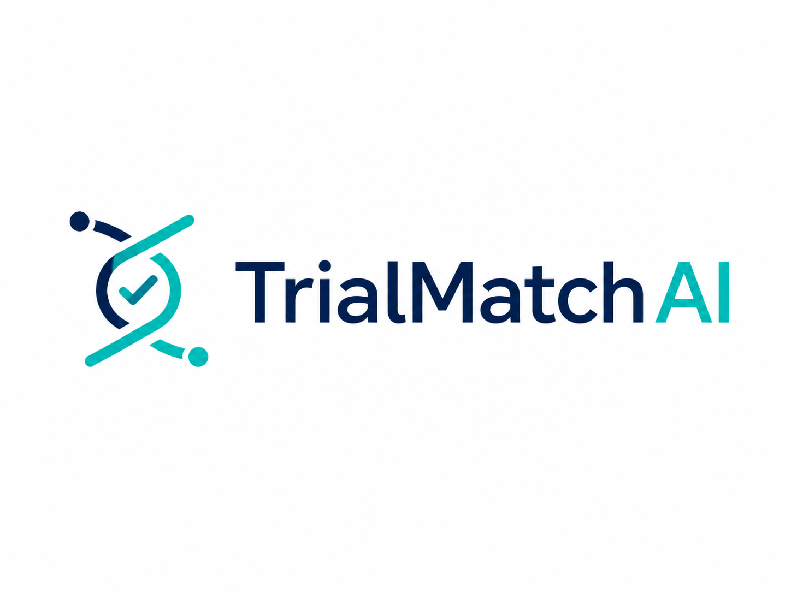

# TrialMatchAI



**AI-driven clinical trial matching.** TrialMatchAI ingests patient data, finds
relevant trials with hybrid local retrieval, and produces ranked recommendations
with **criterion-level eligibility explanations** — all on a single GPU server,
with no external search service.

[Quickstart](#quickstart) · [How it works](#how-it-works) · [Bring your own models](#bring-your-own-models) · [Fine-tuning](docs/finetuning.md) · [Configuration](#configuration) · [CLI](#cli-reference)

> **Disclaimer.** For research and informational use only. This is not medical
> advice, not a medical device, and must not replace review by qualified
> healthcare professionals.

---

## How it works

```text
Patient data (text / FHIR / Phenopacket / OMOP)
      │  interop importers → canonical PatientProfile
      ▼
Biomedical NER (GLiNER) ──► concept linking (OMOP/UMLS, hybrid lexical+vector)
      ▼
First-level retrieval ──► LanceDB hybrid search (BM25 + embeddings) over trials
      ▼
Criterion retrieval + LLM reranker (cross-encoder, Yes/No)
      ▼
CoT eligibility reasoning (per-criterion Met / Not Met / Violated …)
      ▼
Ranking ──► ranked trials + per-criterion explanations  (results/)
```

The generative LLM stages — **reranker and CoT** — run on **vLLM** (the only LLM
backend), which serves fine-tuned **LoRA adapters** natively. Every model stage —
NER, reranker, and CoT — is swappable and fine-tunable (see
[Bring your own models](#bring-your-own-models)).

## Requirements

- Python **3.11**
- [`uv`](https://docs.astral.sh/uv/) recommended (or `pip` with an editable install)
- NVIDIA GPU with enough VRAM for the selected LLM backend
- ~100 GB disk for datasets, models, LanceDB tables, and results
- A LanceDB concept table built from OMOP + curated dictionaries (for entity normalization)

## Quickstart

```bash
# 1. Install. Base CLIs only:
uv sync
# …or the full model-backed stack:
uv sync --extra llm --extra gpu --extra entity
```

| Extra | Adds |
|-------|------|
| `entity` | GLiNER/GLiNER2 biomedical NER |
| `llm` | local embedding + LLM stack (torch, transformers, peft) |
| `gpu` | vLLM + bitsandbytes (Linux) |
| `finetune` | training stack for `trialmatchai-finetune` |

```bash
# 2. Verify config and backends.
uv run trialmatchai-healthcheck --require-tables

# 3. Provision data, concept KB, trials, and search tables.
uv run trialmatchai-bootstrap-data
uv run trialmatchai-build-concepts --concept-csv data/omop/CONCEPT.csv --synonym-csv data/omop/CONCEPT_SYNONYM.csv
uv run trialmatchai-update-registry --since 2026-06-01 --max-studies 100
uv run trialmatchai-index --prepare

# 4. Import patients (text / FHIR / Phenopacket / OMOP — format auto-detected).
uv run trialmatchai-import-patient --input data/patients/raw/patient-1.txt --format text
uv run trialmatchai-import-patient --input data/patients/raw/patient-1.fhir.json
uv run trialmatchai-import-patient --input data/patients/omop_extract --format omop

# 5. Run the batch matcher. Results land in results/.
uv run trialmatchai-run
```

## Bring your own models

Defaults are good starting points, not a ceiling. Point the pipeline at your own
checkpoints or adapters — no code changes:

| Component | Default | Config key |
|-----------|---------|------------|
| Biomedical NER | `fastino/gliner2-base` | `entity_extraction.model_name` |
| Reranker | `google/gemma-2-2b-it` | `model.reranker_adapter_path` |
| CoT eligibility | configured CoT model | `model.cot_adapter_path` |

Train your own with the built-in fine-tuner:

```bash
uv sync --extra finetune
trialmatchai-finetune cot      --base-model microsoft/phi-4      --train-data data/cot.jsonl      --output-dir models/cot-adapter
trialmatchai-finetune reranker --base-model google/gemma-2-2b-it --train-data data/reranker.jsonl --output-dir models/reranker-adapter
trialmatchai-finetune ner      --base-model fastino/gliner2-base --train-data data/ner.jsonl      --output-dir models/ner
```

Full data formats, flags, and plug-back-in steps: **[docs/finetuning.md](docs/finetuning.md)**.

## Configuration

Defaults live in `src/trialmatchai/config/config.json`; override at runtime via
`.env` or environment variables. Common knobs:

```bash
TRIALMATCHAI_SEARCH_DB_PATH=data/search        # embedded LanceDB tables
TRIALMATCHAI_SEARCH_MODE=hybrid                # hybrid | bm25 | vector
TRIALMATCHAI_ENTITY_BACKEND=gliner2            # gliner2 | gliner | regex | disabled
TRIALMATCHAI_ENTITY_SCHEMA_PATH=entity_schemas/trialmatchai.yaml
TRIALMATCHAI_CONCEPT_DB_PATH=data/concepts
TRIALMATCHAI_LINK_ACCEPT=0.80                  # concept-linking accept threshold
TRIALMATCHAI_LINK_REJECT=0.30
TRIALMATCHAI_MODEL_TRUST_REMOTE_CODE=false     # true only if a model requires it
TRIALMATCHAI_LOG_JSON=1                         # structured logs
```

The full set of overrides is documented in [`.env.example`](.env.example).
Patient interoperability details: [docs/interoperability.md](docs/interoperability.md).

## CLI reference

| Command | Purpose |
|---------|---------|
| `trialmatchai-healthcheck` | Validate config, paths, and (optionally) LanceDB tables |
| `trialmatchai-bootstrap-data` | Download/extract external data + model artifacts |
| `trialmatchai-build-concepts` | Build the LanceDB concept table for entity normalization |
| `trialmatchai-update-registry` | Fetch new/changed ClinicalTrials.gov studies and upsert LanceDB |
| `trialmatchai-index` | Build the LanceDB trial + criteria search tables |
| `trialmatchai-import-patient` | Import text / FHIR / Phenopacket / OMOP patient data |
| `trialmatchai-run` | Run the batch matching pipeline |
| `trialmatchai-finetune` | Fine-tune the NER / reranker / CoT models |

The first seven are also available as subcommands of the `trialmatchai` group,
e.g. `uv run trialmatchai healthcheck` or `uv run python -m trialmatchai healthcheck`.

## Deployment

The supported deployment is a single Python 3.11 GPU server/VM. Trial and
criteria search use embedded LanceDB tables under `data/search`, so there is no
separate search service, container, socket, or service credential to manage. The
registry updater is built for cron / systemd timers / GitHub Actions — see
[docs/registry-updater.md](docs/registry-updater.md).

## Security

Never commit real credentials, private keys, datasets, models, local LanceDB
data, run manifests, or results. Copy the template and keep runtime values local:

```bash
cp .env.example .env
```

Artifact bootstrap supports optional SHA-256 verification via
`TRIALMATCHAI_PROCESSED_TRIALS_SHA256`, `TRIALMATCHAI_MODELS_SHA256`, and
`TRIALMATCHAI_CRITERIA_PART_<N>_SHA256`.

Dependency auditing ignores `CVE-2025-3000` because vLLM 0.23 pins Torch 2.11.0
and the advisory lists no fixed Torch version; revisit when upgrading either.

## Development

```bash
uv run ruff check .
uv run pytest
uv run python scripts/scan_secrets.py
uv run pip-audit --progress-spinner off --ignore-vuln CVE-2025-3000
```

## Support & citation

- Email: abdallahmajd7@gmail.com
- DOI: https://doi.org/10.5281/zenodo.18329084
- arXiv: https://arxiv.org/abs/2505.08508
