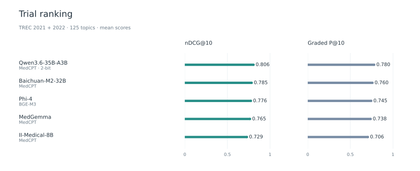
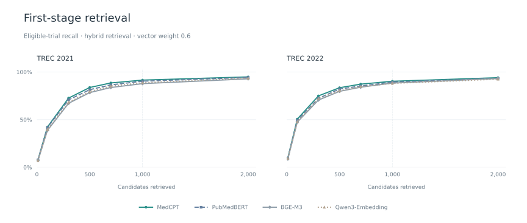
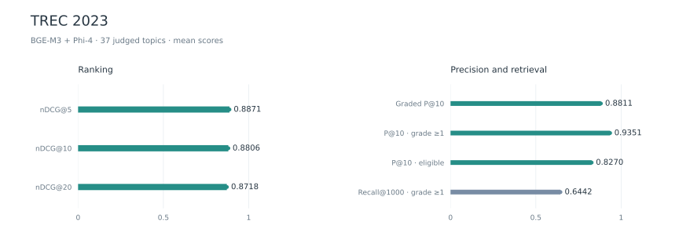

<div align="center">


**A configurable CLI for patient-to-trial retrieval and eligibility review.**

[](https://github.com/cbib/TrialMatchAI/actions/workflows/ci.yml)
[](https://cbib.github.io/TrialMatchAI/)
[](https://pypi.org/project/trialmatchai/)
[](https://github.com/cbib/TrialMatchAI/blob/main/pyproject.toml)
[](https://github.com/cbib/TrialMatchAI/blob/main/LICENSE)

[Try the demo](#try-the-demo) · [Performance](#performance) · [Run your own data](#run-your-own-data) · [Reproduce the paper](#reproduce-the-paper) · [Architecture](#how-matching-works) · [CLI](#cli-reference) · [Development](#development-and-delivery)

</div>

TrialMatchAI imports patient information, searches a local clinical-trial index,
and produces ranked results and portable HTML reports. Configured local models perform biomedical entity extraction, reranking, and
criterion-level eligibility assessment. Query expansion can be enabled separately.

**Release status: beta.** The automated release gates exercise the installed CLI
with synthetic data and real CPU search. They do not qualify GPU inference,
clinical accuracy, or a production clinical deployment. Trial recommendations and
generated explanations require qualified human review; a high retrieval score
does not establish eligibility.

## Try the demo

Use **Python 3.11**. The base installation includes the CLI and embedded search;
it does not install the optional model stack.

```bash
python3.11 -m venv .venv
source .venv/bin/activate
python -m pip install trialmatchai==0.9.1

trialmatchai --version
trialmatchai demo --workdir ./demo-workspace
trialmatchai demo --workdir ./demo-workspace --resume
```

Open the printed `results/demo-patient/report.html` path in a browser. Choose an
empty directory for the first run. The demo creates three synthetic trials and a
synthetic FHIR patient, prepares a real LanceDB index, filters and ranks candidates,
and renders a report. It uses BM25 and deterministic hashing embeddings; model
inference and model downloads are disabled.

Resume preserves completed ranking results and repairs a missing or truncated
patient report. Demo inputs and configuration are checksummed: use a new workspace
for a different configuration. This is a software walkthrough, not a clinical
benchmark.

## What is available

| Area | Implemented today | Qualification boundary |
| :--- | :--- | :--- |
| Patient input | Text, FHIR, Phenopacket, and OMOP importers; canonical profiles and summaries | Format coverage is partial; validate mappings against your source data |
| Retrieval | Local LanceDB tables, BM25/vector/hybrid search, multi-channel fusion, structured filters | Retrieval quality depends on corpus, embeddings, filters, and candidate budgets |
| Model stages | Entity extraction, default-on reranking and eligibility assessment, optional query expansion | Requires extra dependencies, model access, and runtime qualification |
| Review | Ranked JSON, per-trial outputs, individual and multi-patient HTML reports | No hosted clinical workspace, authentication, review queue, or sign-off system |
| Operations | CLI stages, registry updater, checksum tools, synthetic e2e, verified package publishing | Complete cache invalidation, GPU qualification, and application deployment remain open |
| Agent behavior | A fixed sequence of configurable stages, with optional LLM expansion | Bounded retrieval/review agents are planned; autonomous task planning is not implemented |

The [codebase review](https://github.com/cbib/TrialMatchAI/blob/main/docs/codebase-review-2026-09-12.md) records the audit findings.
The [production roadmap](https://github.com/cbib/TrialMatchAI/blob/main/docs/production-roadmap.md) turns them into sequenced work
across ranking quality, clinical workflow, agents, and delivery.

## How matching works


The build path prepares trial records and criterion rows, then indexes them.
During matching, first-level retrieval gathers trial candidates across query
channels; second-level retrieval selects criterion evidence. Reranking, constraint scoring, and default-on eligibility assessment contribute
to the final output.
The code calls its generated eligibility explanations **CoT reasoning**; these
are model outputs to inspect alongside source evidence, not verified clinical
reasoning or a guarantee that every criterion has been covered.

Starting with 0.9.1, eligibility assessment and CoT prompt style have independent
switches:

| `rag.enabled` | `use_cot_reasoning` | Result |
| :--- | :--- | :--- |
| `true` (default) | `true` (default) | Eligibility assessment using the CoT prompt |
| `true` | `false` | Eligibility assessment using the direct JSON prompt |
| `false` | Either | Retrieval-only ranking; no eligibility assessment |

Both assessment prompts request criterion classifications and evidence-based
justifications. `rag.no_think` separately controls supported models' thinking-mode
settings. Rankings record their mode and assessment availability; reports label
retrieval-only results and suppress assessments left over from earlier runs.
Missing or unusable assessment outputs are not an eligibility verdict.

**Migration from 0.9.0:** to disable assessment, explicitly set `rag.enabled: false`.
Setting only `use_cot_reasoning: false` now keeps assessment enabled. Legacy matches
without the new mode metadata are recomputed when matching resumes; changing the
assessment switches or `rag.max_trials_rag` also invalidates their cached results.
Incomplete assessments remain pending on resume, reusing compatible successful
trial outputs and retrying missing or unusable ones. Aborted attempts cannot reuse
verdicts from a prior configuration. This does not establish
complete patient/model/corpus cache identity, which remains roadmap work.

The default configuration selects `BAAI/bge-m3` embeddings,
`fastino/gliner2-base-v1` entity extraction, `google/gemma-2-2b-it` reranking, and
`microsoft/phi-4` eligibility reasoning with TrialMatchAI adapters. Query expansion
is disabled by default. See the [actual defaults](https://github.com/cbib/TrialMatchAI/blob/main/src/trialmatchai/config/config.json)
and [pipeline guide](https://github.com/cbib/TrialMatchAI/blob/main/docs/pipeline.md) for stage controls and configuration.

## Performance

The experiments below compare retrieval embedders and eligibility models in
TrialMatchAI. Source data and per-topic evaluation reports accompany the figures.

### Trial ranking · TREC 2021 and 2022

The five configurations combine MedCPT or BGE-M3 retrieval with different
eligibility models. Scores are topic-weighted means across 75 TREC 2021 and
50 TREC 2022 topics.

<picture>
  <source media="(prefers-color-scheme: dark)" srcset="docs/assets/performance_dark.svg">
  
</picture>

<details>
<summary>Ranking values and evaluation settings</summary>

| Retrieval | Eligibility model | nDCG@10 | Graded P@10 |
| :--- | :--- | ---: | ---: |
| MedCPT | Qwen3.6-35B-A3B (2-bit) | 0.806 | 0.780 |
| MedCPT | Baichuan-M2-32B | 0.785 | 0.760 |
| BGE-M3 | Phi-4 | 0.776 | 0.745 |
| MedCPT | MedGemma | 0.765 | 0.738 |
| MedCPT | II-Medical-8B | 0.729 | 0.706 |

Unjudged trials are removed before applying each cutoff. nDCG uses linear grades,
averages score ties, and normalizes against the ideal ranking of returned judged
trials. Graded P@10 is the sum of the top-ten relevance grades divided by 20.

[Chart data](benchmarks/readme/ranking-comparison.json) ·
[Per-topic evaluation and policy settings](docs/trec-evaluation.md).
The published study's results and definitions are available in the
[paper results report](docs/paper-reproduction.md).

</details>

### Retrieval recall by embedder

First-stage retrieval is evaluated on the judged-trial pool with hybrid search
at vector weight 0.6. Recall counts eligible trials, corresponding to qrels
grade 2; concept linking is held fixed across the four embedders.

<picture>
  <source media="(prefers-color-scheme: dark)" srcset="docs/assets/recall_dark.svg">
  
</picture>

<details>
<summary>Recall at 1,000 candidates and source data</summary>

| Embedder | TREC 2021 | TREC 2022 |
| :--- | ---: | ---: |
| MedCPT | 91.49% | 90.27% |
| PubMedBERT | 90.34% | 89.38% |
| BGE-M3 | 87.78% | 88.37% |
| Qwen3-Embedding | 88.70% | 88.02% |

Values are mean per-topic recall over 75 topics in 2021 and 50 in 2022.
[Embedder benchmark data](benchmarks/embedders) ·
[Benchmark runner](scripts/benchmark_embedder.py).

</details>

### TREC 2023 · BGE-M3 + Phi-4

The 2023 experiment uses structured patient topics and reports mean scores over
the 37 topics with official judgments. The indexed corpus contains 17,103 of
17,106 judged trial IDs. Ranking metrics remove unjudged trials before applying
each cutoff; retrieval recall counts qrels grades 1 and 2.

<picture>
  <source media="(prefers-color-scheme: dark)" srcset="docs/assets/trec2023_dark.svg">
  
</picture>

<details>
<summary>TREC 2023 values and per-topic results</summary>

| Metric | Mean |
| :--- | ---: |
| nDCG@5 | 0.8871 |
| nDCG@10 | 0.8806 |
| nDCG@20 | 0.8718 |
| Graded P@10 | 0.8811 |
| Precision@10 · grade ≥1 | 0.9351 |
| Precision@10 · eligible | 0.8270 |
| First-stage recall@1000 · grade ≥1 | 0.6442 |

[Evaluation report](benchmarks/trec/bge-m3-phi4-trec23.json) includes per-topic
scores, both unjudged-document policies, and hashes of the qrels and evaluated
inputs. These results describe the judged-pool experiment.

</details>

Regenerate the light and dark SVG figures with
`python scripts/render_readme_visuals.py` in an environment with Matplotlib.

## Run your own data

### 1. Select an environment and configuration

The declared runtime is Python 3.11. CI verifies Linux CPU execution. Model memory,
CUDA compatibility, and throughput must be established for the configuration and
hardware you select; there is no universal single-GPU capacity promise.

| Installation | Intended use |
| :--- | :--- |
| `trialmatchai` | CLI, synthetic CPU demo, import/report/artifact utilities |
| `trialmatchai[entity]` | GLiNER2 entity extraction and its model dependencies |
| `trialmatchai[llm]` | Embedding and language-model dependencies |
| `trialmatchai[llm,gpu,entity]` | Optional full model stack on a compatible Linux CUDA host |
| `trialmatchai[finetune]` | Training dependencies; see the [fine-tuning guide](https://github.com/cbib/TrialMatchAI/blob/main/docs/finetuning.md) |

For the default model pipeline, install its extras in a dedicated environment:

```bash
python -m pip install 'trialmatchai[llm,gpu,entity]==0.9.1'
```

The optional inference stack has unresolved dependency advisories and has not
passed full GPU load/inference qualification in this release. Review the
[validation record](https://github.com/cbib/TrialMatchAI/blob/main/docs/production-validation.md) before deploying it.

Export the packaged configuration into your workspace:

```bash
python - <<'PY'
from importlib.resources import files
from pathlib import Path
Path("config.json").write_text(
    files("trialmatchai").joinpath("config/config.json").read_text(encoding="utf-8"),
    encoding="utf-8",
)
PY
```

Edit the model, data, output, and device settings for your installation.
For adapters, supply downloaded local directories: the current path normalizer
treats Hub adapter IDs as local paths, an open P09 compatibility issue. The
[configuration schema](https://github.com/cbib/TrialMatchAI/blob/main/src/trialmatchai/config/settings.py) and [environment example](https://github.com/cbib/TrialMatchAI/blob/main/.env.example)
describe overrides. Obtain access to any gated models before running the pipeline.
Model and vocabulary downloads, registry refreshes, and access checks can use the
network; deploying locally does not by itself establish an offline or compliant
environment.

### 2. Prepare and index trials

Use normalized trial JSON under `data/trials_jsons/`, then prepare and index it:

```bash
trialmatchai build --config config.json
trialmatchai build --config config.json --status
```

Alternatively, `bootstrap-data` downloads the configured prepared corpus archives.
For verified downloads, obtain their expected digests through a trusted channel:

```bash
trialmatchai bootstrap-data --root . --checksum-manifest /path/to/trusted/SHA256SUMS
trialmatchai index --config config.json
```

The manifest path above is a placeholder for your trusted **corpus** manifest;
package-release checksums do not authenticate separately hosted corpus archives.
Bootstrap without digests remains supported for legacy sources and warns that
verification is unavailable. Use compatible embedding settings when indexing
precomputed vectors.

Concept linking is optional. `trialmatchai build --config config.json --concepts`
builds the open-vocabulary concept store; licensed OMOP vocabulary files can be
supplied separately. See [pipeline guide](https://github.com/cbib/TrialMatchAI/blob/main/docs/pipeline.md).

### 3. Import, match, and review

```bash
trialmatchai e2e --config config.json --input patient.fhir.json --format fhir
trialmatchai report --config config.json --patient YOUR_PATIENT_ID
trialmatchai report --config config.json --all
```

Replace `YOUR_PATIENT_ID` with the imported profile ID. Text notes, Phenopacket JSON,
and OMOP extract directories are also accepted by the importer. FHIR resources
with explicit unresolved patient references are rejected in strict mode or kept
as unsupported input in lenient mode; they are not silently assigned to the sole
patient. Consult the [interoperability guide](https://github.com/cbib/TrialMatchAI/blob/main/docs/interoperability.md) for supported
fields and validation behavior.

With default paths, the workspace contains:

```text
data/
├── trials_jsons/          # normalized registry records
├── processed_trials/     # prepared trial records
├── processed_criteria/   # prepared eligibility criteria
├── search/               # embedded LanceDB search tables
└── patients/             # raw copies, canonical profiles, summaries
results/
├── <patient-id>/
│   ├── ranked_trials.json
│   └── report.html
└── index.html            # multi-patient report
```

Reports can contain patient information. Configure access, retention, and sharing
for your environment. The repository does not provide these organizational
controls.

## CLI reference

Run `trialmatchai <command> --help` for the current options.

| Command | Purpose |
| :--- | :--- |
| `demo` | Exercise synthetic import, CPU search, reporting, and resume |
| `pipeline` | Select stages with `--only`, `--from`, `--to`, `--skip`, and `--force` |
| `build` / `index` | Prepare the corpus and build search tables / index prepared data |
| `build-concepts` | Build the optional concept-linking store |
| `bootstrap-data` | Download and extract prepared data and optional model/training archives |
| `import-patient` | Create canonical patient profiles and summaries |
| `e2e` / `run` | Import and match / match staged profiles |
| `report` | Render a patient report or the multi-patient front page |
| `update-registry` | Fetch and upsert ClinicalTrials.gov studies; optional watch mode |
| `trec` | Run TREC Clinical Trials evaluation presets |
| `trec-evaluate` | Re-score completed TREC rankings with explicit unjudged policies; no GPU inference |
| `reproduce-paper` | Verify and recalculate the published TREC 2021/2022 result artifact |
| `finetune` | Train supported reasoning, reranker, or NER components |
| `healthcheck` | Inspect configured dependencies, paths, and services |
| `artifacts` | Create or verify portable SHA-256 manifests |

Resume is stage-specific. Completion files do not yet fingerprint every input,
configuration, and model revision. After changing these, explicitly rebuild or
force the affected stages; successful resume alone does not prove data freshness.
Registry synchronization and deletion/status propagation also need qualification
before use as a live trial directory.

### Checksums and bootstrap recovery

```bash
trialmatchai artifacts manifest ./artifacts --json
trialmatchai artifacts verify ./artifacts/SHA256SUMS --require-exact --json
```

Verification rejects missing/corrupt files, unsafe paths, and symlinks; exact mode
also rejects unexpected files. Trusted bootstrap digests bind the downloaded
archives to completion markers. Corrupt caches are quarantined with a bounded
retry. Changed archives extract into fresh trees, with previous trees retained as
backups and unrelated model directories preserved.

Bootstrap serializes writers and recovers interrupted publication on the next
run. Replacement uses two directory renames, so stop consumers during updates.
Resume checks marker provenance and managed roots; it does not rehash all extracted
files. Backups and quarantine files consume disk until reviewed and removed. See
the [delivery runbook](https://github.com/cbib/TrialMatchAI/blob/main/docs/release.md) for the exact guarantees and legacy migration.

## Evaluation and quality

`trialmatchai trec --tracks "21 22"` and `--tracks "23"` expose the benchmark
presets. Reproducible comparisons require fixed corpus snapshots, topics, qrels,
model revisions, configuration, and a stated treatment of unjudged trials.
The current evaluator and retrieval pipeline have open audit findings; this
release does not claim a newly measured ranking improvement or a validated
comparison against another system.

Completed rankings can be evaluated without repeating retrieval or model
inference. `trialmatchai trec-evaluate` reports both condensed metrics that
exclude unjudged trials and metrics that retain unjudged trials with gain zero.
See the [TREC evaluation guide](https://github.com/cbib/TrialMatchAI/blob/main/docs/trec-evaluation.md)
for commands, input fingerprints, and measured policy sensitivity across the
existing complete runs.

## Reproduce the paper

Check the published result archive on CPU using saved outputs:

```bash
trialmatchai reproduce-paper --workdir ./paper-reproduction
```

The command calculates ranking and retrieval metrics from the deposited results
and official qrels, checks the input checksums, and records the metric definitions
and per-track summaries in its JSON report.

Across the 125 topics, pooled median eligible-trial recall is 90.91% at 1,000
candidates, representing 2.05% of the combined judged-trial corpus.
In the synthetic ideal-candidate experiment, the originating trial ranks first
for 92 of 100 patients and within the top ten for 100 of 100.

For offline use, pass `--archive /path/to/matching_results.zip`,
`--qrels-dir /path/to/qrels`, and `--no-download`. See the
[paper results and reproduction report](docs/paper-reproduction.md) for the
ranking tables, recall definitions, downloadable per-topic values, and checksums.

## Development and delivery

```bash
git clone https://github.com/cbib/TrialMatchAI.git
cd TrialMatchAI
uv sync --frozen                 # CI uses uv 0.11.24 and Python 3.11
make lint
make test
make demo
make release-check              # full local package/CLI/security rehearsal
```

CI and release publishing use the same verification workflow: frozen dependency
resolution, lint, workflow validation, tests, secret/dependency scanning, optional
CPU model imports, package construction, and an isolated installed-wheel CLI e2e.
The smoke checks real indexing, filtering, ranking, HTML, report repair, resume,
and checksum commands with model downloads disabled.

Release tags must match package and module versions. Publishing verifies the tested
wheel and sdist against SHA-256 digests, records build inputs, attaches provenance,
and uses PyPI trusted publishing without rebuilding. These are package delivery
gates; production application deployment, GPU integration tests, complete optional
stack auditing, and clinical acceptance gates remain roadmap work.

Use the [release runbook](https://github.com/cbib/TrialMatchAI/blob/main/docs/release.md), [validation evidence](https://github.com/cbib/TrialMatchAI/blob/main/docs/production-validation.md),
[security policy](https://github.com/cbib/TrialMatchAI/blob/main/SECURITY.md) when preparing
changes. Report reproducible bugs through [GitHub issues](https://github.com/cbib/TrialMatchAI/issues);
do not include identifiable patient data or credentials.

## Research and license

Abdallah, M. *et al.* **TrialMatchAI: an end-to-end AI-powered clinical trial
recommendation system to streamline patient-to-trial matching.** *Nature
Communications* **17**, 4472 (2026).
[Read the paper and citation](https://doi.org/10.1038/s41467-026-70509-w).

TrialMatchAI code is distributed under the [MIT license](https://github.com/cbib/TrialMatchAI/blob/main/LICENSE). Datasets,
model weights, and clinical vocabularies have their own terms.
