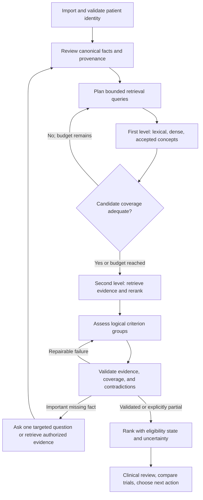

**TrialMatchAI repository review — 12 September 2026**

Reviewed revision: `508db33` (version `0.8.2`). Priority: balanced ranking quality and a usable clinical workflow.

**Assessment:** TrialMatchAI has a substantial research implementation, useful component boundaries, and a meaningful regression suite. Its main obstacle is inconsistent contracts between patient import, retrieval, constraints, model assessment, cached results, evaluation, and reporting. Several of those inconsistencies can produce confidently presented but stale or unsupported results. Correct these before expanding model autonomy or using headline ranking metrics to select a production configuration.

This is a repository-wide static review with targeted execution, not a certification of clinical accuracy or a completed GPU benchmark. The tracked inventory includes **110 package Python files / 19,252 lines**, **57 test files / 8,713 lines**, two benchmark scripts, configuration, schemas, templates, documentation, and CI/release workflows. Source inspection followed the import → prepare/link/index → first retrieval → criterion reranking → eligibility → ranking → report flows, plus registry updates, training, resume, and evaluation. Binary model weights, private patient records, and large runtime corpora were not audited. No application fixes were applied.

Review evidence is in [synthetic probes](audit_2026_09_12_reproduce.py), [recorded observations](audit_2026_09_12_observations.json), [file inventory with hashes](audit_2026_09_12_inventory.json), and [validation record](audit_2026_09_12_validation.md). The probes use invented patients and trials, local temporary directories, and no inference or network calls. They reproduce current behavior; they deliberately are not regression tests asserting desired behavior.

Severity below means: **P0** blocks trustworthy clinical workflow; **P1** materially affects correctness, ranking, installation, or repeatability; **P2** affects maintainability, performance, or usability. “Reproduced” means an executable synthetic observation exists. “Static” means the behavior follows from source and call flow; it was not exercised with production models/data. Proposed improvements and their expected benefits remain hypotheses until evaluated.

**Release and clinical correctness findings**

1. **P0 — FHIR can attach another patient's resource to the only available patient, even in strict mode. Reproduced A03.** `_profile_for_resource` falls back to the sole profile after failing to resolve an explicit subject reference. A bundle with Patient A and a Condition whose subject is Patient B imports B's condition into A. Bundles without Patient resources also collapse onto one fallback profile. Resolve explicit references strictly; quarantine or reject unresolved subjects, and distinguish a genuinely absent subject from a contradictory subject. Add mixed-patient, missing-patient, and versioned-reference fixtures. Evidence: [src/trialmatchai/interop/importers/fhir.py:203](https://github.com/cbib/TrialMatchAI/blob/508db336ee79fdf6cc076fc3da9731fe9cba6751/src/trialmatchai/interop/importers/fhir.py#L203).

2. **P0 — Rematching can reuse eligibility decisions from an earlier patient/trial/model version. Reproduced A04/A05/A06.** The outer runner disables patient-level resume on force or a changed corpus, but `BaseTrialProcessor.process_trials` independently skips existing trial JSON whenever it has no `error` key. The inner cache has no patient, trial, prompt, adapter, or generation fingerprint. Even `{"unrelated": true}` becomes a completed result. Separately, `_match_signature` omits the CoT adapter, its revision, many search/constraint settings, and assessment limits; ingest skips existing patient IDs, and runtime loading trusts existing summaries. Use immutable run IDs, schema-validated outputs, and per-artifact dependency hashes; propagate force to every dependent stage. A changed fact must invalidate affected criterion assessments and ranking. Evidence: [src/trialmatchai/matching/eligibility_base.py:249](https://github.com/cbib/TrialMatchAI/blob/508db336ee79fdf6cc076fc3da9731fe9cba6751/src/trialmatchai/matching/eligibility_base.py#L249), [src/trialmatchai/orchestration.py:381](https://github.com/cbib/TrialMatchAI/blob/508db336ee79fdf6cc076fc3da9731fe9cba6751/src/trialmatchai/orchestration.py#L381), [src/trialmatchai/orchestration.py:65](https://github.com/cbib/TrialMatchAI/blob/508db336ee79fdf6cc076fc3da9731fe9cba6751/src/trialmatchai/orchestration.py#L65), [src/trialmatchai/main.py:716](https://github.com/cbib/TrialMatchAI/blob/508db336ee79fdf6cc076fc3da9731fe9cba6751/src/trialmatchai/main.py#L716).

3. **P0 — Missing information becomes affirmative clinical evidence in deterministic constraints. Reproduced A08/A09.** No recorded condition satisfies an “absence required” inclusion with signal `+1`; no recorded exclusion condition produces “matched” with `+0.25`, without evidence. An “EGFR testing ordered; result pending” fact satisfies a mutation requirement because any matching non-negative gene mention is accepted. Missing, explicitly absent, pending, historical, and present need separate states. Require a scoped negative assertion for absence and a gene–alteration–result relationship for biomarkers. Evidence: [src/trialmatchai/constraints/evaluation.py:273](https://github.com/cbib/TrialMatchAI/blob/508db336ee79fdf6cc076fc3da9731fe9cba6751/src/trialmatchai/constraints/evaluation.py#L273), [src/trialmatchai/constraints/evaluation.py:306](https://github.com/cbib/TrialMatchAI/blob/508db336ee79fdf6cc076fc3da9731fe9cba6751/src/trialmatchai/constraints/evaluation.py#L306).

4. **P0 — Generated query expansion overwrites the narrative subsequently used as clinical evidence. Static; active when expansion is enabled.** `enrich_summary` replaces `patient_narrative` with generated `expanded_sentences`; the eligibility stage consumes that narrative. An omission or hallucination in expansion can therefore alter the evidentiary basis of the final decision, while deterministic constraints still consume the canonical profile. Keep generated retrieval terms in a separate derived object. Clinical assessment should use source facts and verbatim evidence, with generated summaries traceable to them. Evidence: [src/trialmatchai/matching/query_expansion.py:237](https://github.com/cbib/TrialMatchAI/blob/508db336ee79fdf6cc076fc3da9731fe9cba6751/src/trialmatchai/matching/query_expansion.py#L237), [src/trialmatchai/main.py:365](https://github.com/cbib/TrialMatchAI/blob/508db336ee79fdf6cc076fc3da9731fe9cba6751/src/trialmatchai/main.py#L365).

5. **P1 — Default adapter identifiers are converted into nonexistent local paths. Reproduced A01.** Both shipped Hugging Face adapter IDs become absolute paths beneath the runtime root. The reranker preflight requires that local path to exist, so the documented default first-use download path cannot succeed on a clean setup. The CoT loader likewise receives the transformed path. Introduce an explicit model reference contract distinguishing local directories from Hub repositories, resolve adapters to pinned snapshots, and validate the resulting adapter before loading it. Also make “merged checkpoint, no adapter” a supported reranker configuration: current preflight requires a reranker adapter despite the merge documentation. Evidence: [src/trialmatchai/config/config_loader.py:213](https://github.com/cbib/TrialMatchAI/blob/508db336ee79fdf6cc076fc3da9731fe9cba6751/src/trialmatchai/config/config_loader.py#L213), [src/trialmatchai/services/preflight.py:83](https://github.com/cbib/TrialMatchAI/blob/508db336ee79fdf6cc076fc3da9731fe9cba6751/src/trialmatchai/services/preflight.py#L83), [src/trialmatchai/models/llm/vllm_loader.py:260](https://github.com/cbib/TrialMatchAI/blob/508db336ee79fdf6cc076fc3da9731fe9cba6751/src/trialmatchai/models/llm/vllm_loader.py#L260).

6. **P1 — Ranking does not consistently encode eligibility. Reproduced A07.** Nine met inclusions plus one explicitly failed inclusion score `0.9`; one met inclusion plus ten unclear exclusions scores `1.0`; a generation error and a violated exclusion both score `-1`. The model's `Final Decision` is ignored by scoring but displayed by the report. These are different clinical and operational states. Derive an explicit decision from the complete logical criterion assessment; keep retrieval relevance, eligibility state, evidence completeness, and operational failure separate. Rank within appropriate states without presenting the numeric score as a probability. Evidence: [src/trialmatchai/matching/trial_ranker.py:58](https://github.com/cbib/TrialMatchAI/blob/508db336ee79fdf6cc076fc3da9731fe9cba6751/src/trialmatchai/matching/trial_ranker.py#L58), [src/trialmatchai/interop/exporters/html_report.py:125](https://github.com/cbib/TrialMatchAI/blob/508db336ee79fdf6cc076fc3da9731fe9cba6751/src/trialmatchai/interop/exporters/html_report.py#L125).

7. **P1 — Criteria are flattened without preserving logical groups. Static.** Constraint sets contain a flat list, and aggregation takes the minimum nonzero signal. “A OR B” inclusions cannot be represented faithfully; “A AND B” exclusions can be penalized when only A holds. Chunking also loses parent clauses, and criterion IDs hash trial ID plus text, omitting polarity and position, so identical inclusion/exclusion text collides. Preserve sections, parent-child relationships, AND/OR/NOT, exceptions, time anchors, and source spans. Only apply a hard decision when the relevant logical group is complete. Evidence: [src/trialmatchai/constraints/models.py:64](https://github.com/cbib/TrialMatchAI/blob/508db336ee79fdf6cc076fc3da9731fe9cba6751/src/trialmatchai/constraints/models.py#L64), [src/trialmatchai/constraints/evaluation.py:46](https://github.com/cbib/TrialMatchAI/blob/508db336ee79fdf6cc076fc3da9731fe9cba6751/src/trialmatchai/constraints/evaluation.py#L46), [src/trialmatchai/registry/criteria_chunking.py:1](https://github.com/cbib/TrialMatchAI/blob/508db336ee79fdf6cc076fc3da9731fe9cba6751/src/trialmatchai/registry/criteria_chunking.py#L1), [src/trialmatchai/registry/preparation.py:205](https://github.com/cbib/TrialMatchAI/blob/508db336ee79fdf6cc076fc3da9731fe9cba6751/src/trialmatchai/registry/preparation.py#L205).

8. **P1 — Clinical numeric and temporal semantics are too weak for definitive decisions. Static.** Measurements are parsed from the first number in a description, losing inequality/range semantics. Missing units are treated as compatible; matching measurements are chosen by lexical/code similarity and input order, without selecting by date. Temporal constraints return unknown, while prior/current concept constraints effectively use presence. Implement typed quantities with comparators, normalized units, measurement dates, encounter context, and explicit temporal intervals. Missing units or unresolved timing should cause abstention. Evidence: [src/trialmatchai/constraints/evaluation.py:228](https://github.com/cbib/TrialMatchAI/blob/508db336ee79fdf6cc076fc3da9731fe9cba6751/src/trialmatchai/constraints/evaluation.py#L228), [src/trialmatchai/constraints/evaluation.py:236](https://github.com/cbib/TrialMatchAI/blob/508db336ee79fdf6cc076fc3da9731fe9cba6751/src/trialmatchai/constraints/evaluation.py#L236), [src/trialmatchai/constraints/evaluation.py:413](https://github.com/cbib/TrialMatchAI/blob/508db336ee79fdf6cc076fc3da9731fe9cba6751/src/trialmatchai/constraints/evaluation.py#L413).

9. **P1 — Import preserves some source content but does not preserve enough assertion semantics for matching. Static.** Text NER turns entity mentions into positive patient facts without negation, experiencer, or temporal scope. A disease in “no diabetes” or a relative's history can become a patient condition. FHIR resolved/remission/inactive conditions are represented as negated, obscuring historical disease; medication orders and actual exposure are not distinguished by downstream constraints. OMOP observation values are dropped; measurement operators and some dates are not carried into decision logic. Phenopacket disease exclusion and staging information are not consistently propagated into the narrative/assessment path. Add assertions and typed observations to the canonical model, then test clinically meaningful round trips and source-to-criterion evidence. Evidence: [src/trialmatchai/interop/importers/text.py:89](https://github.com/cbib/TrialMatchAI/blob/508db336ee79fdf6cc076fc3da9731fe9cba6751/src/trialmatchai/interop/importers/text.py#L89), [src/trialmatchai/interop/importers/fhir.py:285](https://github.com/cbib/TrialMatchAI/blob/508db336ee79fdf6cc076fc3da9731fe9cba6751/src/trialmatchai/interop/importers/fhir.py#L285), [src/trialmatchai/interop/importers/omop.py:258](https://github.com/cbib/TrialMatchAI/blob/508db336ee79fdf6cc076fc3da9731fe9cba6751/src/trialmatchai/interop/importers/omop.py#L258), [src/trialmatchai/interop/importers/phenopacket.py:1](https://github.com/cbib/TrialMatchAI/blob/508db336ee79fdf6cc076fc3da9731fe9cba6751/src/trialmatchai/interop/importers/phenopacket.py#L1).

10. **P1 — Standard exports are lossy and can be structurally invalid. Reproduced A16; schema comparison.** The FHIR exporter uses one generic `code`-based resource constructor. MedicationStatement has no required `status` or `medication[x]`; Observation similarly lacks required status, and actual measurement values are placed in notes rather than typed value fields. Several fact categories are omitted without a FHIR conversion report. Phenopacket export also approximates values and dates, and its loss report only covers selected omitted categories. Use resource-specific mappers and declare/export the supported standard version. Validate against official schemas and report every meaningful loss, including assertion/timing loss. Evidence: [src/trialmatchai/interop/exporters/fhir.py:53](https://github.com/cbib/TrialMatchAI/blob/508db336ee79fdf6cc076fc3da9731fe9cba6751/src/trialmatchai/interop/exporters/fhir.py#L53), [src/trialmatchai/interop/exporters/phenopacket.py:6](https://github.com/cbib/TrialMatchAI/blob/508db336ee79fdf6cc076fc3da9731fe9cba6751/src/trialmatchai/interop/exporters/phenopacket.py#L6). The required FHIR fields are documented in [HL7 MedicationStatement R4](https://hl7.org/fhir/R4/medicationstatement.html) and [HL7 Observation R4](https://hl7.org/fhir/R4/observation.html).

**Retrieval and ranking findings**

11. **P1 — Default second-stage scoring removes exclusion criteria from trial aggregation. Reproduced A02.** A maximum reranker probability of `1.0` becomes `0.25` after exclusion weighting, below the default aggregation threshold `0.5`. Even the default favorable exclusion constraint adjustment does not bridge that gap. Exclusion evidence therefore cannot influence aggregation as intended under these defaults. Threshold criterion relevance before polarity weighting, and carry contradictory evidence separately instead of discarding it. Test both an exclusion-only hit and a trial with strong inclusion relevance plus a disqualifying exclusion. Evidence: [src/trialmatchai/matching/retrieval/criteria_retrieval.py:30](https://github.com/cbib/TrialMatchAI/blob/508db336ee79fdf6cc076fc3da9731fe9cba6751/src/trialmatchai/matching/retrieval/criteria_retrieval.py#L30), [src/trialmatchai/matching/retrieval/criteria_retrieval.py:112](https://github.com/cbib/TrialMatchAI/blob/508db336ee79fdf6cc076fc3da9731fe9cba6751/src/trialmatchai/matching/retrieval/criteria_retrieval.py#L112), [src/trialmatchai/matching/retrieval/criteria_retrieval.py:203](https://github.com/cbib/TrialMatchAI/blob/508db336ee79fdf6cc076fc3da9731fe9cba6751/src/trialmatchai/matching/retrieval/criteria_retrieval.py#L203).

12. **P1 — The reranker often receives a query fragment in place of patient evidence. Static.** Its prompt asks whether the patient text contains enough information to assess a criterion, including satisfaction or violation. However, the supplied “patient text” is the retrieval query. The caller takes the first ten deduplicated main conditions, other conditions, and narrative fragments, in that order; ten condition terms can remove the narrative entirely. A high score means assessability/relevance, not eligibility, yet it drives candidate selection and score refinement. Supply a stable clinical context plus criterion-specific evidence to reranking, preserve a relevance score, and train/evaluate a separate support/contradiction/unknown classifier if needed. Evidence: [src/trialmatchai/main.py:288](https://github.com/cbib/TrialMatchAI/blob/508db336ee79fdf6cc076fc3da9731fe9cba6751/src/trialmatchai/main.py#L288), [src/trialmatchai/matching/retrieval/criteria_retrieval.py:112](https://github.com/cbib/TrialMatchAI/blob/508db336ee79fdf6cc076fc3da9731fe9cba6751/src/trialmatchai/matching/retrieval/criteria_retrieval.py#L112), [src/trialmatchai/models/llm/llm_reranker.py:82](https://github.com/cbib/TrialMatchAI/blob/508db336ee79fdf6cc076fc3da9731fe9cba6751/src/trialmatchai/models/llm/llm_reranker.py#L82).

13. **P1 — Embedding changes can leave old vectors in place and label them as current. Static.** Build-level fingerprints detect some configuration changes, but per-trial preparation skips based only on source/output mtime and parseable JSON. `build_system` then calls `build_index(force=True)`, bypassing the latter's auto-detection of an embedder change. Existing prepared vectors may be reused, after which the new model identity is written. Direct index builds can skip on existing tables despite a changed corpus/filter or an explicit re-embed request. The identity omits pooling, some lengths/instructions, and revision. Use the embedder's existing full fingerprint everywhere, attach it to every prepared artifact, and never publish an index whose document vectors disagree with the query encoder contract. Evidence: [src/trialmatchai/orchestration.py:240](https://github.com/cbib/TrialMatchAI/blob/508db336ee79fdf6cc076fc3da9731fe9cba6751/src/trialmatchai/orchestration.py#L240), [src/trialmatchai/orchestration.py:303](https://github.com/cbib/TrialMatchAI/blob/508db336ee79fdf6cc076fc3da9731fe9cba6751/src/trialmatchai/orchestration.py#L303), [src/trialmatchai/orchestration.py:606](https://github.com/cbib/TrialMatchAI/blob/508db336ee79fdf6cc076fc3da9731fe9cba6751/src/trialmatchai/orchestration.py#L606), [src/trialmatchai/orchestration.py:757](https://github.com/cbib/TrialMatchAI/blob/508db336ee79fdf6cc076fc3da9731fe9cba6751/src/trialmatchai/orchestration.py#L757), [src/trialmatchai/orchestration.py:849](https://github.com/cbib/TrialMatchAI/blob/508db336ee79fdf6cc076fc3da9731fe9cba6751/src/trialmatchai/orchestration.py#L849).

14. **P1 — Vector corruption is hidden by truncation/padding. Reproduced A11; static index paths.** Cosine/dot helpers crop unequal vectors to the shorter length; index preparation pads/truncates to a majority dimension. Cosine between `[1]` and `[1,99]` becomes `1.0`. Mixed models of the same dimension are also undetectable by shape alone. Fail on any fingerprint/dimension mismatch; validate finite values and expected normalization before index publication. Evidence: [src/trialmatchai/search/lancedb_backend.py:849](https://github.com/cbib/TrialMatchAI/blob/508db336ee79fdf6cc076fc3da9731fe9cba6751/src/trialmatchai/search/lancedb_backend.py#L849), [src/trialmatchai/search/lancedb_backend.py:965](https://github.com/cbib/TrialMatchAI/blob/508db336ee79fdf6cc076fc3da9731fe9cba6751/src/trialmatchai/search/lancedb_backend.py#L965).

15. **P1 — BGE-M3 has conflicting pooling contracts in the repository. Static plus upstream verification.** The shipped explicit config and benchmark registry use mean pooling, while the internal model catalog uses CLS. Thus selecting the BGE catalog name changes representation even for the same model name, and the benchmark does not test its published native pooling configuration. Standardize the contract and rerun a controlled CLS-versus-mean ablation with freshly embedded documents and a compatible concept store. No numerical gain is established by this review. Evidence: [src/trialmatchai/config/config.json:87](https://github.com/cbib/TrialMatchAI/blob/508db336ee79fdf6cc076fc3da9731fe9cba6751/src/trialmatchai/config/config.json#L87), [src/trialmatchai/config/catalog/embedders.json:2](https://github.com/cbib/TrialMatchAI/blob/508db336ee79fdf6cc076fc3da9731fe9cba6751/src/trialmatchai/config/catalog/embedders.json#L2), [benchmarks/embedders/registry.json:3](https://github.com/cbib/TrialMatchAI/blob/508db336ee79fdf6cc076fc3da9731fe9cba6751/benchmarks/embedders/registry.json#L3), [scripts/benchmark_embedder.py:43](https://github.com/cbib/TrialMatchAI/blob/508db336ee79fdf6cc076fc3da9731fe9cba6751/scripts/benchmark_embedder.py#L43). [BGE-M3's published pooling configuration](https://huggingface.co/BAAI/bge-m3/blob/main/1_Pooling/config.json) enables CLS and disables mean pooling.

16. **P1 — Filtering after candidate retrieval can destroy recall without refill. Static.** Age/sex/status filtering happens after a bounded ANN/FTS candidate set is acquired. If that set is dominated by incompatible trials, valid matches just beyond the limit disappear. Location filtering is also applied after fusion. Additionally, the runtime sets `overall_status = "All"`, making the configured status hard-filter channel ineffective for a clinical “open trials” workflow. Push suitable filters into candidate acquisition, overfetch/refill with bounds, retain unknown demographics, and make recruitment preference explicit. Measure how many eligible candidates each filter removes. Evidence: [src/trialmatchai/search/lancedb_backend.py:355](https://github.com/cbib/TrialMatchAI/blob/508db336ee79fdf6cc076fc3da9731fe9cba6751/src/trialmatchai/search/lancedb_backend.py#L355), [src/trialmatchai/search/lancedb_backend.py:613](https://github.com/cbib/TrialMatchAI/blob/508db336ee79fdf6cc076fc3da9731fe9cba6751/src/trialmatchai/search/lancedb_backend.py#L613), [src/trialmatchai/main.py:122](https://github.com/cbib/TrialMatchAI/blob/508db336ee79fdf6cc076fc3da9731fe9cba6751/src/trialmatchai/main.py#L122), [src/trialmatchai/matching/retrieval/trial_retrieval.py:1](https://github.com/cbib/TrialMatchAI/blob/508db336ee79fdf6cc076fc3da9731fe9cba6751/src/trialmatchai/matching/retrieval/trial_retrieval.py#L1).

17. **P1 — Rejected concept candidates re-enter the search index as synonyms. Reproduced A12.** `_flatten_entities` appends candidate names based on candidate score without checking the final linker acceptance state. The linker's RRF normalization can give its best candidate score `1.0` even when the absolute acceptance gate rejects it. This bypasses the NIL-aware linker and introduces unrelated search terms. Index accepted concepts/synonyms only; retain rejected candidates as diagnostics. Evidence: [src/trialmatchai/search/lancedb_backend.py:941](https://github.com/cbib/TrialMatchAI/blob/508db336ee79fdf6cc076fc3da9731fe9cba6751/src/trialmatchai/search/lancedb_backend.py#L941), [src/trialmatchai/entities/linker.py:246](https://github.com/cbib/TrialMatchAI/blob/508db336ee79fdf6cc076fc3da9731fe9cba6751/src/trialmatchai/entities/linker.py#L246), [src/trialmatchai/entities/linker.py:409](https://github.com/cbib/TrialMatchAI/blob/508db336ee79fdf6cc076fc3da9731fe9cba6751/src/trialmatchai/entities/linker.py#L409).

18. **P2 — Empty candidate scopes broaden criterion search. Reproduced A10.** `nct_ids=[]` behaves like an unrestricted search because the backend treats an empty set as no filter. The current pipeline ultimately slices to zero trials, but still performs global retrieval and potentially reranking; direct callers receive unrelated trials. Reserve `None` for unrestricted search and return immediately for an empty allowed set. Evidence: [src/trialmatchai/search/lancedb_backend.py:680](https://github.com/cbib/TrialMatchAI/blob/508db336ee79fdf6cc076fc3da9731fe9cba6751/src/trialmatchai/search/lancedb_backend.py#L680), [src/trialmatchai/search/lancedb_backend.py:1037](https://github.com/cbib/TrialMatchAI/blob/508db336ee79fdf6cc076fc3da9731fe9cba6751/src/trialmatchai/search/lancedb_backend.py#L1037), [src/trialmatchai/main.py:295](https://github.com/cbib/TrialMatchAI/blob/508db336ee79fdf6cc076fc3da9731fe9cba6751/src/trialmatchai/main.py#L295).

19. **P2 — Candidate aggregation favors criterion volume and lacks coverage guarantees. Static/design risk.** The default aggregate combines `sum(scores)/sqrt(count)` with a maximum, rewarding trials with more retrieved high-scoring criteria. Each query retrieves a shared pool of 250 criteria, so some candidate trials can receive no assessment evidence. Concurrent query completion also influences insertion order and tied trial order. Add per-trial evidence quotas, deterministic ID tie-breaks, criterion-group deduplication, and learned/calibrated aggregation evaluated against simple coverage-normalized baselines. Evidence: [src/trialmatchai/matching/retrieval/criteria_retrieval.py:98](https://github.com/cbib/TrialMatchAI/blob/508db336ee79fdf6cc076fc3da9731fe9cba6751/src/trialmatchai/matching/retrieval/criteria_retrieval.py#L98), [src/trialmatchai/matching/retrieval/criteria_retrieval.py:229](https://github.com/cbib/TrialMatchAI/blob/508db336ee79fdf6cc076fc3da9731fe9cba6751/src/trialmatchai/matching/retrieval/criteria_retrieval.py#L229).

20. **P2 — Search fallbacks and metric handling can mask a degraded retrieval path. Static.** Backend search exceptions can fall back to a bounded table scan; a successful-looking result may reflect an arbitrary prefix of the corpus. Criterion vector-index creation uses the default cosine argument rather than consistently passing the selected backend metric. Report channel health, fallback reasons, and candidate counts in the run; require metric parity when building and querying both tables. Treat a failed retrieval channel as degraded execution with an explicit recovery policy. Evidence: [src/trialmatchai/search/lancedb_backend.py:297](https://github.com/cbib/TrialMatchAI/blob/508db336ee79fdf6cc076fc3da9731fe9cba6751/src/trialmatchai/search/lancedb_backend.py#L297), [src/trialmatchai/search/lancedb_backend.py:329](https://github.com/cbib/TrialMatchAI/blob/508db336ee79fdf6cc076fc3da9731fe9cba6751/src/trialmatchai/search/lancedb_backend.py#L329), [src/trialmatchai/search/lancedb_backend.py:441](https://github.com/cbib/TrialMatchAI/blob/508db336ee79fdf6cc076fc3da9731fe9cba6751/src/trialmatchai/search/lancedb_backend.py#L441).

**Eligibility generation, state, and registry findings**

21. **P1 — Context budgeting can omit criteria and produce incomplete assessments. Static.** The vLLM processor truncates criterion text from the tail; exclusions commonly appear there. Input budgeting reserves only a fraction of requested output tokens, so the input allowance and requested output can exceed the context window together. The Transformers processor left-truncates the whole prompt, potentially removing instructions and early criteria. Optional guided JSON controls shape but does not ensure every criterion was assessed. Chunk logical criterion groups, allocate input/output against the actual loaded model window, require every expected criterion ID to receive a state, and explicitly mark incomplete assessments. Evidence: [src/trialmatchai/matching/eligibility_reasoning_vllm.py:78](https://github.com/cbib/TrialMatchAI/blob/508db336ee79fdf6cc076fc3da9731fe9cba6751/src/trialmatchai/matching/eligibility_reasoning_vllm.py#L78), [src/trialmatchai/matching/eligibility_reasoning_vllm.py:115](https://github.com/cbib/TrialMatchAI/blob/508db336ee79fdf6cc076fc3da9731fe9cba6751/src/trialmatchai/matching/eligibility_reasoning_vllm.py#L115), [src/trialmatchai/matching/eligibility_reasoning_transformers.py:49](https://github.com/cbib/TrialMatchAI/blob/508db336ee79fdf6cc076fc3da9731fe9cba6751/src/trialmatchai/matching/eligibility_reasoning_transformers.py#L49), [src/trialmatchai/matching/eligibility_reasoning_transformers.py:127](https://github.com/cbib/TrialMatchAI/blob/508db336ee79fdf6cc076fc3da9731fe9cba6751/src/trialmatchai/matching/eligibility_reasoning_transformers.py#L127).

22. **P1 — Failure handling and completion markers disagree. Static; A06/A15 support the output-state issue.** Output persistence accepts any parsed object and can swallow write failures. Partial eligibility output can omit trials from the final ranking. Mixed patient success/failure returns success, and the match fingerprint is recorded regardless of the matching return code. An old ranked file plus a failed rerun can therefore satisfy future resume checks. Give every trial and stage an explicit pending/running/complete/partial/failed state; propagate failed persistence; publish a completed run only after validating expected outputs. Evidence: [src/trialmatchai/matching/eligibility_base.py:196](https://github.com/cbib/TrialMatchAI/blob/508db336ee79fdf6cc076fc3da9731fe9cba6751/src/trialmatchai/matching/eligibility_base.py#L196), [src/trialmatchai/main.py:443](https://github.com/cbib/TrialMatchAI/blob/508db336ee79fdf6cc076fc3da9731fe9cba6751/src/trialmatchai/main.py#L443), [src/trialmatchai/main.py:697](https://github.com/cbib/TrialMatchAI/blob/508db336ee79fdf6cc076fc3da9731fe9cba6751/src/trialmatchai/main.py#L697), [src/trialmatchai/orchestration.py:471](https://github.com/cbib/TrialMatchAI/blob/508db336ee79fdf6cc076fc3da9731fe9cba6751/src/trialmatchai/orchestration.py#L471).

23. **P1 — Registry refresh does not reliably remove stale recruitment status. Static.** Queries fetch only configured active statuses. A previously indexed recruiting trial that transitions to completed/withdrawn is then absent from those responses and can retain its old status locally. Reconcile all tracked IDs independently of the “discover open trials” query; maintain a durable update watermark with overlap, retries, and tombstones. Separate recruitment status from clinical eligibility. Evidence: [src/trialmatchai/registry/defaults.py:1](https://github.com/cbib/TrialMatchAI/blob/508db336ee79fdf6cc076fc3da9731fe9cba6751/src/trialmatchai/registry/defaults.py#L1), [src/trialmatchai/registry/clinicaltrials_gov.py:1](https://github.com/cbib/TrialMatchAI/blob/508db336ee79fdf6cc076fc3da9731fe9cba6751/src/trialmatchai/registry/clinicaltrials_gov.py#L1), [src/trialmatchai/registry/updater.py:89](https://github.com/cbib/TrialMatchAI/blob/508db336ee79fdf6cc076fc3da9731fe9cba6751/src/trialmatchai/registry/updater.py#L89).

24. **P1 — Registry updates can create different trial versions across retrieval and reasoning. Static.** The updater writes raw/normalized data and directly updates index tables, but does not refresh the prepared trial/criterion files. Eligibility loading prefers prepared trials before normalized source data, so retrieval may use new criteria while CoT uses old criteria. A previous `fetched` manifest record is also considered complete even when a later run enables reindexing, leaving that trial unindexed until its source changes. Publish a versioned trial snapshot used by both retrieval and assessment, with separate fetched/prepared/indexed milestones. Evidence: [src/trialmatchai/registry/updater.py:159](https://github.com/cbib/TrialMatchAI/blob/508db336ee79fdf6cc076fc3da9731fe9cba6751/src/trialmatchai/registry/updater.py#L159), [src/trialmatchai/registry/updater.py:175](https://github.com/cbib/TrialMatchAI/blob/508db336ee79fdf6cc076fc3da9731fe9cba6751/src/trialmatchai/registry/updater.py#L175), [src/trialmatchai/main.py:350](https://github.com/cbib/TrialMatchAI/blob/508db336ee79fdf6cc076fc3da9731fe9cba6751/src/trialmatchai/main.py#L350).

25. **P1 — Corpus publication is not atomic across artifacts. Static; stale-empty case reproduced A17.** Criteria replacement deletes the old directory before writing the new files; an empty replacement leaves the old directory intact. Temporary prepared JSON files also end in `.json`, unlike the safer utility writers, so crash leftovers can match reader globs. Trial and criterion tables are replaced separately; updates delete then add rows. A crash or concurrent reader can observe a mixed snapshot. Write a complete immutable version, validate counts and fingerprints, then switch one manifest pointer; use batch upserts and delayed cleanup. Evidence: [src/trialmatchai/registry/preparation.py:161](https://github.com/cbib/TrialMatchAI/blob/508db336ee79fdf6cc076fc3da9731fe9cba6751/src/trialmatchai/registry/preparation.py#L161), [src/trialmatchai/registry/preparation.py:187](https://github.com/cbib/TrialMatchAI/blob/508db336ee79fdf6cc076fc3da9731fe9cba6751/src/trialmatchai/registry/preparation.py#L187), [src/trialmatchai/orchestration.py:343](https://github.com/cbib/TrialMatchAI/blob/508db336ee79fdf6cc076fc3da9731fe9cba6751/src/trialmatchai/orchestration.py#L343), [src/trialmatchai/search/lancedb_backend.py:301](https://github.com/cbib/TrialMatchAI/blob/508db336ee79fdf6cc076fc3da9731fe9cba6751/src/trialmatchai/search/lancedb_backend.py#L301).

26. **P1 — Backend and fine-tuning interchangeability is incomplete. Static.** Transformers reranker/eligibility constructors never apply the configured adapters. Switching to that backend alone also passes the default numeric device as string `"0"`, which is not a valid Torch device specification. NER fine-tuning defaults to adapter-only output and recommends using that directory as `model_name`, but the recognizer calls only `GLiNER2.from_pretrained`; the installed loader explicitly requires loading the base and then `load_adapter`. Provide a single resolved model specification with backend capability validation, normalized devices, and a train → save → reload → infer smoke test. Evidence: [src/trialmatchai/main.py:390](https://github.com/cbib/TrialMatchAI/blob/508db336ee79fdf6cc076fc3da9731fe9cba6751/src/trialmatchai/main.py#L390), [src/trialmatchai/main.py:536](https://github.com/cbib/TrialMatchAI/blob/508db336ee79fdf6cc076fc3da9731fe9cba6751/src/trialmatchai/main.py#L536), [src/trialmatchai/models/llm/transformers_reranker.py:17](https://github.com/cbib/TrialMatchAI/blob/508db336ee79fdf6cc076fc3da9731fe9cba6751/src/trialmatchai/models/llm/transformers_reranker.py#L17), [src/trialmatchai/entities/recognizers.py:196](https://github.com/cbib/TrialMatchAI/blob/508db336ee79fdf6cc076fc3da9731fe9cba6751/src/trialmatchai/entities/recognizers.py#L196), [src/trialmatchai/finetuning/ner.py:173](https://github.com/cbib/TrialMatchAI/blob/508db336ee79fdf6cc076fc3da9731fe9cba6751/src/trialmatchai/finetuning/ner.py#L173).

**Evaluation and user experience findings**

27. **P1 — Missing patients and empty rankings are omitted from reported averages. Reproduced A13.** Evaluation skips absent patient directories entirely, and skips ranking metrics for empty ranked lists. With three expected topics, one successful ranking, one missing patient, and one empty directory, only two topics are “scored,” one is “ranked,” and mean nDCG is `1.0`. Evaluate the complete declared topic set; failed/empty retrieval or ranking contributes zero where the metric is defined. Report both service completion and quality, and distinguish topics without relevant judgments from execution failures. Evidence: [src/trialmatchai/trec/qrels.py:194](https://github.com/cbib/TrialMatchAI/blob/508db336ee79fdf6cc076fc3da9731fe9cba6751/src/trialmatchai/trec/qrels.py#L194), [src/trialmatchai/trec/qrels.py:218](https://github.com/cbib/TrialMatchAI/blob/508db336ee79fdf6cc076fc3da9731fe9cba6751/src/trialmatchai/trec/qrels.py#L218).

28. **P1 — Default nDCG measures ordering within the returned judged set, not end-to-end retrieval quality. Reproduced A14.** Returning one of ten equally eligible trials yields default nDCG@10 `1.0`; the existing full-ideal variant yields approximately `0.2201`. That conditional metric is useful when labeled precisely, but is not a substitute for full-task nDCG. Both variants condense the numerator by removing unjudged results, so `ndcg_full` is still not simply standard uncondensed `trec_eval` nDCG. Keep conditional, condensed, and standard metrics under explicit names and verify reference parity on miniature runs. Evidence: [src/trialmatchai/trec/metrics.py:61](https://github.com/cbib/TrialMatchAI/blob/508db336ee79fdf6cc076fc3da9731fe9cba6751/src/trialmatchai/trec/metrics.py#L61), [src/trialmatchai/trec/qrels.py:219](https://github.com/cbib/TrialMatchAI/blob/508db336ee79fdf6cc076fc3da9731fe9cba6751/src/trialmatchai/trec/qrels.py#L219). Use the [NIST trec_eval implementation](https://github.com/usnistgov/trec_eval/blob/main/m_ndcg_cut.c) as a reference for standard nDCG rather than relying on a “trec_eval-style” label.

29. **P1 — Benchmark corpus/provenance limits prevent strong conclusions from the headline plots alone. Static.** The TREC runner derives its corpus filter from the union of qrels trial IDs, creating a restricted candidate task. Backfill can use live registry records in a historical evaluation. The tracked benchmark JSONs support first-level embedder curves, but the repository does not contain equivalent full per-topic ranking bundles/configurations for every reasoner in the headline performance figure. The README already acknowledges the TrialGPT cohort mismatch and the restricted 2023 task; retain those qualifications and avoid interpreting the chart as a matched full-corpus comparison. Archive frozen corpus IDs/versions, exact configs/adapters, run files, evaluator version, all topic outcomes, and figure-generation code for each reported result. Evidence: [src/trialmatchai/trec/runner.py:132](https://github.com/cbib/TrialMatchAI/blob/508db336ee79fdf6cc076fc3da9731fe9cba6751/src/trialmatchai/trec/runner.py#L132), [src/trialmatchai/trec/backfill.py:1](https://github.com/cbib/TrialMatchAI/blob/508db336ee79fdf6cc076fc3da9731fe9cba6751/src/trialmatchai/trec/backfill.py#L1), [scripts/benchmark_embedder.py:168](https://github.com/cbib/TrialMatchAI/blob/508db336ee79fdf6cc076fc3da9731fe9cba6751/scripts/benchmark_embedder.py#L168), [README.md:62](https://github.com/cbib/TrialMatchAI/blob/508db336ee79fdf6cc076fc3da9731fe9cba6751/README.md#L62). Official track data are indexed by [NIST](https://trec.nist.gov/data/trials.html).

30. **P1 — Report data can mix versions, and operational failure is not a first-class UI state. Reproduced A15; static joins.** Reports prefer current summaries and prepared metadata while reading existing rankings. `processing_failed` is treated as `reasoning_available=true` because only one error sentinel is excluded. The report can therefore show a new patient description next to an old assessment, or an empty assessment without a useful retry state. Render one immutable run snapshot; include patient/trial update times, assessed/total criterion counts, evidence links, missing facts, and a specific failed/partial state. The displayed decision must come from the same validated decision object used for ranking. Evidence: [src/trialmatchai/interop/exporters/html_report.py:125](https://github.com/cbib/TrialMatchAI/blob/508db336ee79fdf6cc076fc3da9731fe9cba6751/src/trialmatchai/interop/exporters/html_report.py#L125), [src/trialmatchai/interop/exporters/html_report.py:220](https://github.com/cbib/TrialMatchAI/blob/508db336ee79fdf6cc076fc3da9731fe9cba6751/src/trialmatchai/interop/exporters/html_report.py#L220).

31. **P1 for an interactive deployment — There is no complete clinical work queue or feedback loop. Product gap.** The current product is a batch CLI plus a portable HTML report. It has useful search/filter/print behavior, but no persistent fact correction, pending questions, job cancellation/retry, reviewer overrides, trial comparison, case assignment, or referral tracking. The report also does not present site distance/contact details needed to act on a match. Build a thin application over a versioned job API, retain the CLI, and make the primary task “review evidence and decide the next action.” Add user/account access controls and export handling when introducing shared hosting; the existing self-contained report embeds patient data and is not access-controlled merely because only one patient is visible. Evidence: [src/trialmatchai/cli/report.py:26](https://github.com/cbib/TrialMatchAI/blob/508db336ee79fdf6cc076fc3da9731fe9cba6751/src/trialmatchai/cli/report.py#L26), [src/trialmatchai/interop/exporters/templates/report.html:327](https://github.com/cbib/TrialMatchAI/blob/508db336ee79fdf6cc076fc3da9731fe9cba6751/src/trialmatchai/interop/exporters/templates/report.html#L327), [src/trialmatchai/interop/exporters/templates/report.html:365](https://github.com/cbib/TrialMatchAI/blob/508db336ee79fdf6cc076fc3da9731fe9cba6751/src/trialmatchai/interop/exporters/templates/report.html#L365), [src/trialmatchai/registry/preparation.py:86](https://github.com/cbib/TrialMatchAI/blob/508db336ee79fdf6cc076fc3da9731fe9cba6751/src/trialmatchai/registry/preparation.py#L86).

32. **P1 — Canonical patient IDs are not constrained at the filesystem boundary. Reproduced A18 without writing outside a temporary output root.** Importers sanitize IDs, but a directly supplied `PatientProfile` accepts `../synthetic-escape`; runtime output paths join that ID without containment validation. This is a local input-boundary defect, not evidence of an exposed remote endpoint. Validate canonical IDs, enforce resolved-path containment, and namespace imported identities by source organization/dataset to avoid collisions. Evidence: [src/trialmatchai/interop/models.py:1](https://github.com/cbib/TrialMatchAI/blob/508db336ee79fdf6cc076fc3da9731fe9cba6751/src/trialmatchai/interop/models.py#L1), [src/trialmatchai/main.py:588](https://github.com/cbib/TrialMatchAI/blob/508db336ee79fdf6cc076fc3da9731fe9cba6751/src/trialmatchai/main.py#L588).

**Duplication, dead paths, and maintenance findings**

33. **P1 — The built wheel omits the embedder catalog. Build reproduced.** Building this revision with local setuptools `81.0.0` produced `trialmatchai-0.8.2-py3-none-any.whl` containing `config/config.json` but no `config/catalog/embedders.json`. The package-data patterns do not include the nested catalog. Missing catalogs silently become `{}`, so `model: "medcpt"` resolves differently outside the checkout. Include the resource and test every catalog entry from an installed wheel outside the repository. Evidence: [pyproject.toml:122](https://github.com/cbib/TrialMatchAI/blob/508db336ee79fdf6cc076fc3da9731fe9cba6751/pyproject.toml#L122), [src/trialmatchai/config/config_loader.py:52](https://github.com/cbib/TrialMatchAI/blob/508db336ee79fdf6cc076fc3da9731fe9cba6751/src/trialmatchai/config/config_loader.py#L52).

34. **P2 — Several exposed settings are inert or have competing sources of truth. Static.** `constraints.llm_extraction_enabled` has no runtime consumer; first-level LLM expansion is not wired to an expander by the main caller; the global NER threshold is not used for schema-level filtering; GLiNER batch size is stored but recognition loops per text; runtime linker construction ignores configured margin. CoT and reranker batching use different configuration sections depending on backend, including `rag.batch_size * 2` for vLLM reranking. The old model quantization/tokenizer sections do not drive the main loaders, and allowing arbitrary vLLM extra keys does not forward them automatically. Publish effective resolved settings and reject unsupported knobs, then consolidate each behavior under one contract. Evidence: [src/trialmatchai/config/settings.py:237](https://github.com/cbib/TrialMatchAI/blob/508db336ee79fdf6cc076fc3da9731fe9cba6751/src/trialmatchai/config/settings.py#L237), [src/trialmatchai/registry/preparation.py:144](https://github.com/cbib/TrialMatchAI/blob/508db336ee79fdf6cc076fc3da9731fe9cba6751/src/trialmatchai/registry/preparation.py#L144), [src/trialmatchai/entities/annotator.py:85](https://github.com/cbib/TrialMatchAI/blob/508db336ee79fdf6cc076fc3da9731fe9cba6751/src/trialmatchai/entities/annotator.py#L85), [src/trialmatchai/entities/recognizers.py:199](https://github.com/cbib/TrialMatchAI/blob/508db336ee79fdf6cc076fc3da9731fe9cba6751/src/trialmatchai/entities/recognizers.py#L199), [src/trialmatchai/main.py:558](https://github.com/cbib/TrialMatchAI/blob/508db336ee79fdf6cc076fc3da9731fe9cba6751/src/trialmatchai/main.py#L558).

35. **P2 — Multiple pipelines and fingerprint systems duplicate policy and drift. Static.** `pipeline.py`, `orchestration.py`, `main.py`, and the TREC runner have overlapping lifecycle decisions; build/match/link/index/concept-store caches use different identities. Runtime query expansion and planner expansion are separate mechanisms. Multiple JSON/atomic writers have different temporary-file guarantees. `--skip expand` does not remove an already-expanded summary, so it is not a clean ablation by itself. Share one stage executor, artifact store, model contract, expansion interface, and atomic writer; preserve thin CLI/TREC presets. Evidence: [src/trialmatchai/pipeline.py:1](https://github.com/cbib/TrialMatchAI/blob/508db336ee79fdf6cc076fc3da9731fe9cba6751/src/trialmatchai/pipeline.py#L1), [src/trialmatchai/orchestration.py:1](https://github.com/cbib/TrialMatchAI/blob/508db336ee79fdf6cc076fc3da9731fe9cba6751/src/trialmatchai/orchestration.py#L1), [src/trialmatchai/utils/file_utils.py:20](https://github.com/cbib/TrialMatchAI/blob/508db336ee79fdf6cc076fc3da9731fe9cba6751/src/trialmatchai/utils/file_utils.py#L20), [src/trialmatchai/utils/pipeline_state.py:70](https://github.com/cbib/TrialMatchAI/blob/508db336ee79fdf6cc076fc3da9731fe9cba6751/src/trialmatchai/utils/pipeline_state.py#L70).

36. **P2 — Dead-code candidates should be removed or explicitly retained as public compatibility. Static reference search.** `_has_entries` in bootstrap has no caller. `utils/temporal_utils.py` has no package/test caller; newer temporal helpers live in interop utilities. `_INDEX_TEMPLATE`/`render_index_html` are unused by the active reporting flow but remain exported and tested, so deprecate before removal if external callers matter. The embedder `fingerprint()` contract is implemented and tested but unused by runtime index provenance: wire it in, rather than delete it. Evidence: [src/trialmatchai/cli/bootstrap_data.py:248](https://github.com/cbib/TrialMatchAI/blob/508db336ee79fdf6cc076fc3da9731fe9cba6751/src/trialmatchai/cli/bootstrap_data.py#L248), [src/trialmatchai/utils/temporal_utils.py:1](https://github.com/cbib/TrialMatchAI/blob/508db336ee79fdf6cc076fc3da9731fe9cba6751/src/trialmatchai/utils/temporal_utils.py#L1), [src/trialmatchai/interop/exporters/html_report.py:269](https://github.com/cbib/TrialMatchAI/blob/508db336ee79fdf6cc076fc3da9731fe9cba6751/src/trialmatchai/interop/exporters/html_report.py#L269), [src/trialmatchai/models/embedding/text_embedder.py:101](https://github.com/cbib/TrialMatchAI/blob/508db336ee79fdf6cc076fc3da9731fe9cba6751/src/trialmatchai/models/embedding/text_embedder.py#L101).

37. **P2 — Build/docs/CI do not fully exercise the supported product. Static.** Four Make targets invoke removed executables instead of unified subcommands. Fine-tuning docs say vLLM is the only backend despite the Transformers branch. Installed-wheel smoke checks do not resolve catalog models; the ML smoke job is non-blocking and mostly imports modules, so it cannot validate adapter loading or inference/training API compatibility. Release workflow builds/publishes without an explicit dependency on tests in that workflow. Add installed CLI scenario tests, a required tiny-model adapter round trip, and a separate GPU qualification job for supported stacks. Make release artifacts depend on the applicable verification results. Evidence: [Makefile:33](https://github.com/cbib/TrialMatchAI/blob/508db336ee79fdf6cc076fc3da9731fe9cba6751/Makefile#L33), [docs/finetuning.md:42](https://github.com/cbib/TrialMatchAI/blob/508db336ee79fdf6cc076fc3da9731fe9cba6751/docs/finetuning.md#L42), [.github/workflows/ci.yml:41](https://github.com/cbib/TrialMatchAI/blob/508db336ee79fdf6cc076fc3da9731fe9cba6751/.github/workflows/ci.yml#L41), [.github/workflows/ci.yml:91](https://github.com/cbib/TrialMatchAI/blob/508db336ee79fdf6cc076fc3da9731fe9cba6751/.github/workflows/ci.yml#L91), [.github/workflows/release.yml:19](https://github.com/cbib/TrialMatchAI/blob/508db336ee79fdf6cc076fc3da9731fe9cba6751/.github/workflows/release.yml#L19).

38. **P2 — Bulk operations have avoidable memory and indexing costs. Static/design risk.** Index creation materializes both prepared corpora in lists; registry updates rebuild search structures per changed trial; second-stage queries invoke the same embedder concurrently; normal expansion/matching paths can retain multiple model engines while TREC explicitly frees the expansion model. Add bounded batch ingestion, batch index maintenance, one GPU scheduler with microbatching, and explicit model lifetime budgets. Measure throughput and memory under the real corpus before changing concurrency. Evidence: [src/trialmatchai/orchestration.py:324](https://github.com/cbib/TrialMatchAI/blob/508db336ee79fdf6cc076fc3da9731fe9cba6751/src/trialmatchai/orchestration.py#L324), [src/trialmatchai/registry/updater.py:175](https://github.com/cbib/TrialMatchAI/blob/508db336ee79fdf6cc076fc3da9731fe9cba6751/src/trialmatchai/registry/updater.py#L175), [src/trialmatchai/search/lancedb_backend.py:301](https://github.com/cbib/TrialMatchAI/blob/508db336ee79fdf6cc076fc3da9731fe9cba6751/src/trialmatchai/search/lancedb_backend.py#L301), [src/trialmatchai/matching/retrieval/criteria_retrieval.py:98](https://github.com/cbib/TrialMatchAI/blob/508db336ee79fdf6cc076fc3da9731fe9cba6751/src/trialmatchai/matching/retrieval/criteria_retrieval.py#L98), [src/trialmatchai/trec/runner.py:145](https://github.com/cbib/TrialMatchAI/blob/508db336ee79fdf6cc076fc3da9731fe9cba6751/src/trialmatchai/trec/runner.py#L145).

There are good foundations to preserve: canonical patient profiles with provenance fields; explicit query/document embedding APIs; RRF candidate fusion; separation of retrieval and model wrappers; a shared eligibility base class; constraint diagnostics; incremental registry manifests; numerous synthetic tests; safe HTML text insertion/JSON escaping; and atomic utility writers. The review found substantive gaps around those foundations, rather than a need to rewrite everything.

**A practical agentic design**

Use a durable, bounded state machine with explicit tool contracts. “Agentic” should mean the system can diagnose missing evidence, choose a useful next retrieval or question, recover from failure, and resume coherently. A longer CoT prompt alone does not provide those capabilities.

Start with these versioned contracts:

| Object | Required content |
|---|---|
| Patient snapshot | Identity namespace, source hash, facts, assertion/experiencer, quantities/units, dates, evidence spans, correction history |
| Trial snapshot | Registry ID/version, retrieval timestamp, recruitment/site status, complete criterion tree and source spans |
| Retrieval plan | Source fact IDs, proposed terms, allowed filters, candidate budget, why a refinement was triggered |
| Criterion assessment | Criterion ID/group, met/contradicted/unknown/not applicable, evidence fact IDs, concise justification, rule/model version, coverage state |
| Trial decision | Explicit clinical state, unresolved decisive questions, coverage, relevance score, decision-policy version |
| Run record | Input/config/model/corpus hashes, stage states, tool events, latency/cost/token budgets, retries, artifacts, cancellation state |

Tools should have narrow typed arguments: `retrieve_trials`, `retrieve_criteria(allowed_trial_ids, query)`, `lookup_patient_evidence`, `evaluate_constraints`, `get_trial_snapshot`, `validate_assessment`, `propose_question`, and `assemble_report`. Patient and trial text are evidence, not instructions for the agent. Tool results need source IDs and freshness. External retrieval and data sharing should be explicit deployment capabilities, with a separate user action for outreach/referrals.

At **first retrieval**, seed queries with the clinical problem, stage, biomarker, therapy history, and relevant alternatives. Preserve negation and provenance; generated synonyms must not become facts. Run lexical and model-native dense channels, with accepted ontology concepts as a separate channel. Retry only when a measurable symptom warrants it: empty results, excessive hard-filter loss, low channel diversity, or missing coverage. Allow a small number of refinements and cap newly added candidates. Do not relax confirmed clinical facts to make results appear.

At **second retrieval**, build a compact evidence packet for each candidate rather than scoring isolated query fragments. Retrieve both supportive and contradictory criterion groups. Keep relevance, evidence availability, and eligibility classification separate. Allocate a minimum criterion/evidence budget per trial, then spend extra assessment on promising or uncertain candidates. Log the eligible-candidate retention curve so this stage cannot silently erase first-stage recall.

At **eligibility/CoT**, a reasoning-capable model can assess ambiguous groups internally, but the durable/user-facing output should be structured conclusions, source citations, uncertainty, and short justifications. Do not use a raw thinking transcript as proof. Deterministic rules should handle well-specified numeric/date conditions; uncertain extraction or contradictory sources should trigger abstention or a targeted review. Validate that every expected criterion group has an assessment, every evidence reference exists, and the final decision follows the same policy used by ranking. Use a bounded repair retry for malformed/incomplete output and selective second-model review for consequential disagreements, rather than always doubling inference.

At **follow-up**, prioritize questions by whether their answers could change the top actionable matches. For example, an unresolved biomarker result shared by several otherwise promising trials is more useful than asking about every unknown criterion. Present the source gap, why the question matters, and an “unknown/unavailable” option. Save the response as a sourced correction, invalidate affected decisions, and rerun only dependent work. Batch runs should return a pending-question artifact rather than block indefinitely.

**How to improve the scores credibly**

First establish the correct baseline. Correcting failed-topic accounting and using full-task metrics may initially lower reported numbers. That is an evaluation fix, not evidence that retrieval became worse. Keep a conditional ranking metric for diagnosis, but optimize against complete-task quality and clinical error rates together.

| Layer | Measure | First experiment | Acceptance evidence |
|---|---|---|---|
| First retrieval | Grade-2 and grade-1+2 recall@100/500/1000; per-filter loss; channel contribution | Native BGE CLS vs current mean; MedCPT native query/document contract; candidate refill | Paired per-topic improvement on a frozen holdout, with freshly built compatible indexes |
| Second retrieval | Relevant/eligible retention@20/50/100; oracle ceiling from first stage; criterion coverage | Full patient evidence vs query fragments; exclusion threshold fix; coverage-normalized aggregate | Retains more eligible candidates at the same assessment budget, with no hidden missing-trial omission |
| Eligibility | Per-class precision/recall/F1; false eligibility/exclusion; unknown calibration; evidence correctness | Criterion-group chunks + output validation; typed quantities/dates; targeted disagreement review | Clinician-adjudicated set, including negation, temporal, biomarker, and missing-data cases |
| Final ranking | Standard nDCG@10/20, eligible P@10, eligible recall@20; conditional metrics separately | Explicit state + relevance tie-break vs current fractional inclusion score | All expected topics included, evaluator parity, paired confidence intervals |
| Workflow | Time to first shortlist; time to reviewed shortlist; questions per useful match; correction burden | Evidence review + prioritized follow-up + actionable site information | Observed clinician tasks with recorded completion/error rates |
| Operations | Successful run fraction, stale-result rate, schema/coverage failure rate, p50/p95 latency, GPU memory, cost/patient | Versioned artifacts, partial states, bounded retries, batching | Crash/restart and patient-update tests; load measurements on stated hardware |

Use exact trial IDs and source snapshots for historical TREC evaluations. Run both the restricted-qrels task and a full-corpus task, clearly labeled. Split training, development, and test by patient and trial where feasible, and include temporal or site holdouts. Fine-tune only after establishing semantic labels: the existing reranker “enough information” target cannot be assumed to train eligibility. Mine hard negatives from actual retrieval errors, especially same disease/wrong stage, wrong mutation, prohibited therapy, outdated measurement, and relative-history cases. Preserve a held-out clinical error set and evaluate calibration/abstention, not only training loss.

The separation of retrieval, criterion matching, and trial ranking has a primary-source precedent in [TrialGPT's implementation](https://github.com/ncbi-nlp/TrialGPT). The bounded question/recovery state machine proposed here is a design recommendation for this codebase; it is not a claim that adopting an agent framework automatically improves clinical accuracy.

**Implementation order and acceptance gates**

These are work packages, not calendar promises; model experiments and clinical validation require data, hardware, and reviewers beyond this static review.

| Order | Work package | Scope | Done when |
|---|---|---|---|
| 1 | Correctness and installation | Findings 1–6, 10–11, 27–28, 32–33; shared decision/output schema | Cross-patient import rejected; changed facts cannot reuse stale decisions; missing facts stay unknown; malformed outputs cannot complete; installed default/catalog resolution works; all evaluation topics count |
| 2 | Reproducible corpus and execution | Findings 13–14, 21–25, 29–30 | Every result identifies one patient/trial/model/config snapshot; forced and interrupted runs behave correctly; index/criteria versions are consistent; long criteria are fully covered or explicitly incomplete |
| 3 | Retrieval/ranking experiments | Findings 12, 15–20; ablation harness | Frozen full-task baseline and paired comparison bundles establish which changes help at equal latency/cost |
| 4 | Clinical evidence model | Findings 7–9, 17, 26 | Negation, experiencer, units, dates, logical groups, and biomarkers survive import → assessment; adapter round trips work on supported backends |
| 5 | Usable application | Finding 31 plus reporting improvements | A reviewer can import/correct a case, monitor/cancel/retry matching, inspect evidence, compare trials, answer key questions, and record the next action without editing files |
| 6 | Bounded agent loop | Retrieval refinement, evidence lookup, follow-up, selective repair | Every tool action is traceable, budgets stop loops, missing answers remain pending, and agentic mode outperforms the fixed pipeline on predefined quality/workflow measures |
| 7 | Simplification and sustained validation | Findings 34–38 | One source of truth per setting/stage, obsolete paths removed/deprecated, effective config visible, installed and model integration checks qualify releases |

Small improvements can accompany those packages: fix Make targets; consolidate vocabulary names and field aliases; normalize UI classifications with the same function as ranking; show original rank after filtering; add trial-site links and last-updated dates; distinguish “not run,” “failed,” and “needs information”; persist shortlist/comparison choices; support keyboard/focus navigation after patient changes; redact query/patient text from routine shared logs; make reports atomic; record all omitted/conversion fields; add source checksums and timestamps to downloaded artifacts; and turn unsupported configuration options into actionable errors.

The first useful milestone is a trustworthy fixed pipeline with stable evidence and repeatable metrics. That provides the baseline needed to determine whether retrieval refinement, targeted questions, or additional reasoning actually improves the clinical workflow.
