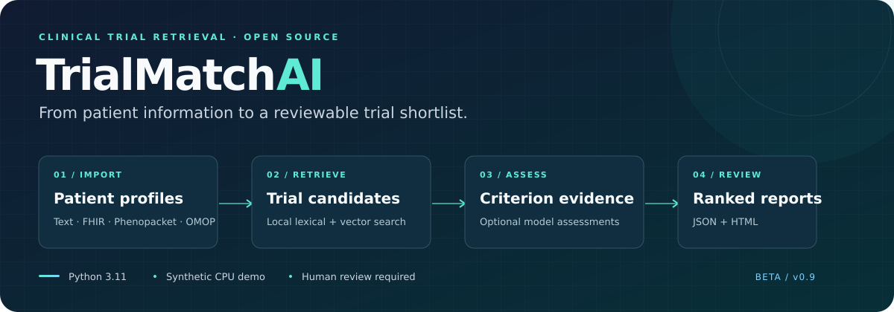

# TrialMatchAI



**A configurable CLI for patient-to-trial retrieval and eligibility review.**
TrialMatchAI imports patient information, searches local LanceDB tables, and writes
ranked results and HTML reports. Optional models add entity extraction, expansion,
reranking, and criterion-level assessments.

!!! info "Beta release — declared validation scope"
    The release gates test the installed CLI with synthetic data and real CPU search.
    GPU inference, clinical accuracy, and production clinical deployment remain
    separate qualification work. Review generated assessments against source evidence;
    a retrieval score is not an eligibility determination.

## Start with the synthetic demo

Install with Python 3.11 in an activated virtual environment:

```bash
python -m pip install trialmatchai==0.9.0
trialmatchai demo --workdir ./demo-workspace
trialmatchai demo --workdir ./demo-workspace --resume
```

Open the report path printed by the command. This walkthrough uses BM25 and
hashing embeddings with model stages disabled. It creates synthetic records only;
resume preserves completed ranking and repairs a missing or truncated patient report.

For your own data, use the [README setup instructions](https://github.com/cbib/TrialMatchAI#run-your-own-data).
Model stages require additional dependencies and configuration. The default adapter
IDs currently need replacement with downloaded local paths. Format mappings, cache
invalidation, and registry freshness have documented limits.

## Guides

| Guide | What it covers |
| --- | --- |
| [Architecture](architecture.md) | Runtime components and local storage |
| [Pipeline and CLI](pipeline.md) | Stages, presets, and report commands |
| [Patient interoperability](interoperability.md) | Supported formats and mappings |
| [Registry updater](registry-updater.md) | Fetching and indexing registry studies |
| [Fine-tuning](finetuning.md) | Training entry points and data formats |
| [API reference](api.md) | Python interfaces |
| [Release runbook](release.md) | Checksums, bootstrap recovery, CI, and publishing |
| [Validation record](production-validation.md) | Checks performed and their limits |
| [Codebase review](codebase-review-2026-09-12.md) | Historical audit evidence |
| [Production roadmap](production-roadmap.md) | Sequenced clinical, ranking, agent, and deployment work |

The current pipeline follows a fixed stage sequence. Bounded agents and a clinical
review workspace are planned. This release does not claim newly improved benchmark
scores; the [paper](https://doi.org/10.1038/s41467-026-70509-w) describes the published
research, while the validation record describes this software release.
